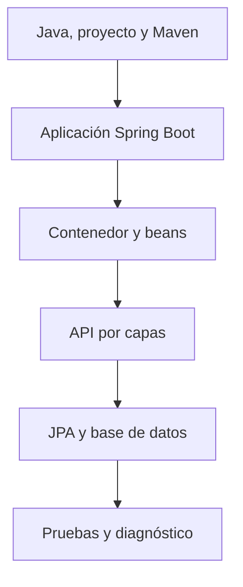

# Unidad 5 — Spring Boot desde cero: objetivos y ruta

## Por qué existe esta unidad

Las unidades 6 a 27 usan Spring Boot como herramienta de trabajo. Antes se suponía que ya sabías iniciar una aplicación, separar controller, service y repository, construir un CRUD y conectar una base de datos. Esta unidad elimina esa suposición.

Aquí empiezas sin conocimientos previos de Spring ni Spring Boot. No se espera que reconozcas sus anotaciones, que sepas qué es un bean o que entiendas qué ocurre al pulsar **Run**. Al terminar tendrás el vocabulario, el modelo mental y la práctica mínima necesarios para que la unidad 6 sea realmente comprensible.

No intenta enseñar todo el ecosistema Spring. Spring Security, microservicios, observabilidad avanzada, contratos, transacciones complejas y testing profundo aparecen después. El objetivo es construir una base sólida y evitar que avances copiando anotaciones sin entenderlas.

## Requisitos reales

Necesitas poder:

- leer clases, métodos, interfaces, constructores, records, enums y excepciones de Java;
- reconocer una colección como `List` y un valor opcional como `Optional`;
- ejecutar comandos en una terminal y localizar archivos;
- usar Git de forma básica o, como mínimo, conservar copias de tus cambios.

No necesitas conocer Spring, servidores web, HTTP, JSON, Maven, JPA ni MySQL de antemano. Esta unidad introduce lo imprescindible de cada uno. Las unidades posteriores profundizan sus detalles.

## Resultado observable

Al terminar podrás abrir un proyecto Spring Boot desconocido y explicar, sin adivinar:

1. qué dependencia permite recibir peticiones web;
2. dónde comienza la aplicación y qué se crea durante el arranque;
3. cómo Spring encuentra y conecta objetos;
4. qué responsabilidad tiene cada capa;
5. cómo un JSON llega al controller y termina como una fila;
6. cómo implementar y probar un CRUD pequeño;
7. cómo cambiar de una base H2 de aprendizaje a MySQL;
8. cómo leer un fallo de arranque y localizar su causa principal;
9. qué partes son automatización de Spring Boot y cuáles siguen siendo decisiones tuyas.

## Mapa mental de la unidad

Cada bloque depende del anterior. Si una anotación aparece antes de que entiendas el objeto que representa, vuelve al bloque previo.

## Archivos y orden recomendado

| Orden | Archivo | Qué aprenderás | Tiempo esencial | Tiempo profesional |
|---:|---|---|---:|---:|
| 1 | `00A-guia-previa-java-maven-y-proyectos.md` | Proyecto, compilación, Maven, POM, `src`, `target`, JAR, IntelliJ y vocabulario previo | 4 h | 6 h |
| 2 | `01-spring-y-spring-boot-desde-cero.md` | Qué problema resuelven Spring y Spring Boot; arranque, Maven y estructura | 3 h | 5 h |
| 3 | `02-ioc-di-beans-y-configuracion.md` | IoC, inyección, beans, escaneo, configuración y perfiles | 4 h | 7 h |
| 4 | `03-api-rest-controller-service-repository-crud.md` | HTTP mínimo, JSON, capas, DTO, validación y CRUD | 5 h | 9 h |
| 5 | `04-jpa-mysql-pruebas-y-diagnostico.md` | Persistencia, H2, MySQL, transacciones, pruebas y errores comunes | 4 h | 7 h |
| 6 | `80-laboratorio-fintechlab-inicial.md` | Construcción guiada de una API completa y transición al proyecto grande | 6 h | 9 h |
| 7 | `90-ejercicios-autoevaluacion-y-rubrica.md` | Práctica deliberada sin respuestas y prueba de salida | 1.5 h | 2 h |
| 8 | `94-antes-durante-despues-de-clase.md` | Uso junto a las clases de la diplomatura | 0.5 h | 1 h |
|  | **Total** |  | **28 h** | **46 h** |

La ruta profesional no significa leer más rápido. Incluye reconstruir ejemplos, provocar fallos, escribir pruebas y explicar decisiones.

## Ruta esencial

Sigue esta ruta si necesitas llegar a la unidad 6 con una base funcional:

1. Lee primero la guía previa y cumple su checklist sin estudiar aún el CRUD.
2. Lee cada capítulo en orden y escribe una frase propia para cada término nuevo.
3. Ejecuta el proyecto de referencia `codigo/fintechlab-inicio` con H2.
4. Sigue una petición POST completa desde el JSON hasta la tabla.
5. Reconstruye un endpoint sin copiar y comprueba su respuesta.
6. Completa U05-E01 a U05-E08.
7. Termina las etapas 0 a 6 del laboratorio.
8. Realiza la prueba de salida sin consultar el texto.

Puedes empezar la unidad 6 cuando alcances el criterio de salida, aunque todavía queden ampliaciones profesionales.

## Ruta profesional

Añade a la ruta esencial:

- todas las cajas de “por dentro”, límites y errores comunes;
- conexión real con MySQL mediante Compose;
- migración versionada con Flyway;
- pruebas unitarias, web y de contexto del proyecto de referencia;
- U05-E09 a U05-E16;
- lectura guiada del monolito completo, sin modificar todavía sus áreas avanzadas;
- una explicación oral de diez minutos usando solo un diagrama propio.

## Semáforo de avance

| Estado | Evidencia | Acción |
|---|---|---|
| Rojo | Solo reconoces anotaciones por su forma | Vuelve al modelo mental y recorre un objeto manualmente |
| Amarillo | El CRUD funciona, pero no puedes explicar el arranque o las capas | Provoca un fallo y dibuja el recorrido completo |
| Verde | Puedes construir, probar y diagnosticar un CRUD pequeño | Continúa con la unidad 6 |

No uses “funcionó una vez” como criterio. La evidencia verde incluye ejecución reproducible, una prueba, un caso de error y una explicación.

## Qué debes memorizar y qué debes consultar

Memoriza únicamente ideas estables:

- Spring administra objetos y sus relaciones;
- Spring Boot configura una aplicación Spring a partir de dependencias, propiedades y condiciones;
- el controller adapta HTTP, el service dirige el caso de uso y el repository persiste;
- una entidad no es el contrato público de la API;
- una prueba debe comprobar comportamiento, no la presencia de anotaciones;
- el primer `Caused by` útil suele acercarte más a la causa que la última línea del log.

Consulta cuando lo necesites:

- nombres exactos de propiedades;
- opciones de cada anotación;
- versiones y compatibilidades;
- métodos de `ResponseEntity`, repositorios y herramientas de prueba;
- configuración específica de un motor de base de datos.

Un profesional no memoriza todo el framework: conserva buenos modelos mentales, sabe encontrar la referencia correcta y valida sus suposiciones.

## Contrato pedagógico

Los ejemplos resueltos enseñan mecanismos. Los ejercicios cambian el escenario o las restricciones para que no puedas responder copiando. No hay soluciones escondidas en esta unidad ni se espera que envíes respuestas ahora: el curso queda completo primero y tú decidirás después cuándo estudiar y pedir corrección.

## Criterio de salida hacia la unidad 6

Marca cada punto solo cuando puedas demostrarlo:

- [ ] Explico la diferencia entre Spring, Spring Boot y Spring MVC.
- [ ] Localizo `pom.xml`, la clase principal y la configuración.
- [ ] Explico `@SpringBootApplication` sin decir solo “arranca Spring”.
- [ ] Distingo un objeto Java creado con `new` de un bean administrado.
- [ ] Uso inyección por constructor y detecto una dependencia circular.
- [ ] Sigo una petición por controller, service y repository.
- [ ] Construyo DTO de entrada y salida sin exponer la entidad.
- [ ] Implemento CREATE, READ, UPDATE y DELETE con respuestas coherentes.
- [ ] Valido entrada y traduzco un recurso ausente a una respuesta controlada.
- [ ] Persisto primero en H2 y después conecto MySQL con variables de entorno.
- [ ] Ejecuto al menos una prueba unitaria y una prueba web o de contexto.
- [ ] Diagnostico un puerto ocupado, un bean ausente y una conexión rechazada.

Si algún punto falta, vuelve al capítulo correspondiente; no es necesario reiniciar toda la unidad.

## Siguiente paso

Abre `00A-guia-previa-java-maven-y-proyectos.md`. Cuando puedas diferenciar proyecto, compilación, ejecución, Maven, `src` y `target`, continúa con `01-spring-y-spring-boot-desde-cero.md`.
