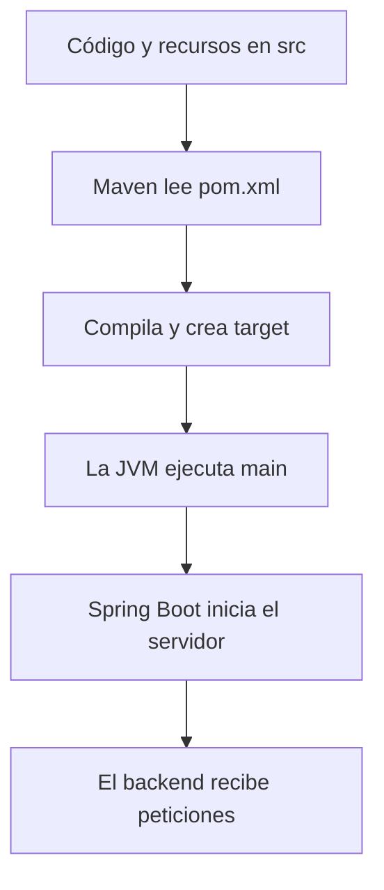

aca# Unidad 5 — Guía previa: Java, Maven y proyectos antes de Spring Boot

## Para qué existe esta guía

El capítulo `01-spring-y-spring-boot-desde-cero.md` utiliza palabras como Maven, dependencia, `pom.xml`, `target`, JAR, classpath, servidor y Spring Boot. Aunque allí se explican brevemente, ver todos esos conceptos juntos puede hacer que el texto parezca avanzar demasiado rápido.

Esta guía retrocede un paso. Parte de una situación mucho más sencilla: tienes código Java dentro de una carpeta y quieres convertirlo en una aplicación que puedas ejecutar.

No necesitas conocer Maven, Spring, Spring Boot, servidores ni bases de datos. Tampoco necesitas leer ahora todo el código del laboratorio. El objetivo es que, cuando aparezcan esas palabras en el capítulo `01`, ya tengas una imagen mental para colocarlas.

## Cómo estudiar esta guía

No intentes memorizar todos los nombres. Trabaja en tres vueltas:

1. **Primera vuelta:** entiende la historia general desde el código hasta la aplicación ejecutándose.
2. **Segunda vuelta:** abre el proyecto `codigo/fintechlab-inicio` y localiza únicamente los archivos indicados.
3. **Tercera vuelta:** explica el recorrido con tus propias palabras sin mirar.

Durante esta guía puedes ignorar por completo:

- controllers;
- services;
- repositories;
- entidades JPA;
- validación;
- MySQL;
- pruebas avanzadas.

Esos temas tienen capítulos propios. Ahora solo aprenderás qué clase de proyecto tienes delante y qué ocurre cuando lo abres, lo construyes y lo ejecutas.

---

# Parte 1 — Antes de Maven: ¿qué es un proyecto?

## 1. Un programa no es solamente un archivo

Cuando comienzas con Java, puedes escribir algo así:

```java
public class Hello {
    public static void main(String[] args) {
        System.out.println("Hola");
    }
}
```

Parece que el programa es únicamente `Hello.java`, pero incluso este ejemplo necesita varias cosas:

- un archivo con código fuente;
- un compilador que entienda Java;
- una JVM capaz de ejecutar el resultado;
- una carpeta donde guardar lo compilado;
- un comando o botón que inicie el proceso.

Una aplicación real añade decenas o miles de clases, archivos de configuración, bibliotecas externas, pruebas y recursos. Por eso se organiza como un **proyecto**.

### Definición sencilla

Un proyecto es una carpeta organizada que reúne todo lo necesario para desarrollar y construir una aplicación.

### Analogía

Piensa en una obra de construcción:

- los archivos Java son los planos de piezas concretas;
- los recursos son carteles, configuraciones y materiales auxiliares;
- las pruebas son inspecciones;
- las bibliotecas externas son piezas compradas a otros fabricantes;
- el archivo de construcción indica qué materiales necesitas y cómo ensamblarlos;
- el resultado final es el edificio utilizable.

La carpeta del proyecto no es todavía la aplicación ejecutándose. Es el conjunto de instrucciones y materiales con los que puedes construirla.

## 2. Archivo, carpeta y ruta

Un **archivo** contiene información y normalmente posee un nombre con extensión:

```text
CustomerService.java
application.yml
pom.xml
```

Una **carpeta** contiene archivos u otras carpetas. Una **ruta** indica cómo llegar hasta algo:

```text
src/main/java/dev/fintechlab/inicio/FintechLabInicioApplication.java
```

Cada `/` representa entrar en otra carpeta. El último elemento es el archivo.

### Ruta relativa y ruta absoluta

Una ruta relativa comienza desde la carpeta en la que estás trabajando:

```text
src/main/java
```

Una ruta absoluta comienza desde la raíz del sistema y localiza el archivo sin depender de tu posición actual. Su forma cambia entre macOS, Linux y Windows.

Cuando un comando responde “no existe el archivo”, muchas veces el archivo sí existe, pero estás situado en otra carpeta.

Puedes pensar en la carpeta actual como tu ubicación en un mapa. El comando no adivina desde dónde quieres empezar.

## 3. Código fuente

El **código fuente** es el texto que escribes y puedes leer:

```text
FintechLabInicioApplication.java
CustomerController.java
```

En Java, estos archivos terminan en `.java`. El sistema operativo no ejecuta directamente el texto como si entendiera su significado completo. Primero debe intervenir el compilador.

## 4. Compilar

**Compilar** significa analizar el código fuente y transformarlo a otra representación que la plataforma pueda ejecutar.

En Java:

```text
archivo .java → compilador javac → archivo .class con bytecode
```

El compilador también busca errores como:

- una llave sin cerrar;
- un tipo incompatible;
- un método que no existe;
- una variable no declarada;
- una dependencia que no está disponible.

### Analogía

El código fuente se parece a una partitura. El bytecode se parece a una versión preparada para la orquesta concreta que la interpretará. Compilar no significa que el concierto ya esté ocurriendo: solo prepara y verifica el material.

### Importante

Que algo compile significa que superó determinados controles. No significa que haga lo correcto.

Este código puede compilar y seguir teniendo un error lógico:

```java
int total = price - quantity; // quizá debía multiplicar
```

## 5. Ejecutar

**Ejecutar** significa iniciar el programa para que sus instrucciones realmente ocurran.

Al ejecutar una aplicación Java:

1. el sistema inicia un proceso;
2. dentro del proceso se inicia la JVM;
3. la JVM carga las clases necesarias;
4. encuentra el punto de entrada;
5. comienza a ejecutar instrucciones.

### Compilar no es ejecutar

| Acción   | Pregunta que responde                          |
| -------- | ---------------------------------------------- |
| Compilar | ¿El código puede transformarse correctamente?  |
| Ejecutar | ¿Qué hace el programa cuando está funcionando? |

Puedes compilar hoy y ejecutar mañana. También puedes intentar ejecutar una versión compilada anteriormente aunque el código fuente haya cambiado, lo cual puede producir confusión. Las herramientas de construcción ayudan a mantener estas etapas ordenadas.

## 6. El método `main`

Una aplicación Java tradicional necesita un punto de entrada:

```java
public static void main(String[] args) {
    // aquí comienza la ejecución de tu código
}
```

No significa que todo el programa deba estar dentro de `main`. Significa que la JVM necesita una primera puerta por la que entrar.

En el proyecto de esta unidad, esa puerta está en:

```text
src/main/java/dev/fintechlab/inicio/FintechLabInicioApplication.java
```

Por ahora no necesitas comprender las anotaciones de esa clase. Solo identifica `main`.

## 7. Proceso

Un **proceso** es un programa que se está ejecutando y utilizando recursos del sistema: memoria, CPU, archivos y, a veces, puertos de red.

Esta distinción es esencial:

- el archivo Java está guardado;
- la clase puede estar compilada;
- el programa puede o no tener un proceso activo.

Cerrar el archivo en IntelliJ no siempre detiene el proceso. Detener el proceso tampoco borra el código.

Si pulsas Run dos veces sin detener la primera aplicación, puedes terminar con dos procesos que intentan usar el mismo puerto.

## 8. Probar

Una **prueba automatizada** también es código. Ejecuta una parte de la aplicación y comprueba que el resultado coincida con una expectativa.

```java
assertEquals(4, calculator.add(2, 2));
```

Maven puede compilar tanto el código de la aplicación como el código de las pruebas y después ejecutar las pruebas.

En esta guía solo necesitas recordar:

```text
compilar prepara y verifica estructura;
ejecutar inicia la aplicación;
probar comprueba comportamientos seleccionados.
```

## 9. Empaquetar

**Empaquetar** significa reunir el resultado compilado y otros recursos en un artefacto que pueda conservarse o ejecutarse.

En Java, un formato habitual es JAR.

### JAR

JAR significa **Java Archive**. Es un archivo que puede contener:

- clases compiladas;
- configuración;
- recursos;
- metadatos;
- en una aplicación Spring Boot, las bibliotecas necesarias para ejecutarla.

### Analogía

Durante el desarrollo tienes piezas distribuidas por el taller. El JAR es una caja de entrega organizada. No es el código fuente original, aunque se construye a partir de él.

Un archivo como este:

```text
fintechlab-inicio-1.0.0-SNAPSHOT.jar
```

es un producto generado. No debes editarlo manualmente para cambiar el programa. Debes cambiar la fuente y volver a construirlo.

---

# Parte 2 — Bibliotecas, dependencias, herramientas y frameworks

## 10. ¿Por qué no escribimos todo desde cero?

Supón que necesitas convertir un objeto Java en JSON. Podrías investigar el formato y escribir toda la conversión. También puedes utilizar una biblioteca probada que ya sabe hacerlo.

Los proyectos modernos combinan:

- código escrito por tu equipo;
- capacidades incluidas en Java;
- código reutilizable de terceros.

## 11. Biblioteca

Una **biblioteca** es código reutilizable que ofrece clases y funciones para resolver un conjunto de problemas.

### Analogía

Una biblioteca se parece a una caja de herramientas. Tú diriges el trabajo y eliges cuándo utilizar un destornillador.

Ejemplos dentro del ecosistema del curso:

- Jackson ayuda a convertir entre JSON y objetos Java;
- JUnit ayuda a escribir pruebas;
- el driver de MySQL permite comunicarse con MySQL.

## 12. Dependencia

Una **dependencia** es algo que tu proyecto necesita para compilar, ejecutarse o probarse.

Una biblioteca externa se convierte en dependencia cuando decides que tu proyecto la necesita.

### Diferencia sencilla

- **Biblioteca:** el producto reutilizable existe.
- **Dependencia:** tu proyecto declara que depende de ese producto.

También una clase propia puede depender de otra. La palabra dependencia expresa una relación de necesidad, no exclusivamente algo descargado de Internet.

## 13. Versión

Las bibliotecas evolucionan. Una versión identifica una publicación concreta:

```text
3.5.15
```

Versiones diferentes pueden:

- corregir errores;
- añadir capacidades;
- retirar métodos;
- cambiar requisitos;
- ser incompatibles entre sí.

Por eso el proyecto debe registrar las versiones y no descargar “cualquier versión disponible” cada vez.

## 14. Herramienta de construcción

Una herramienta de construcción automatiza tareas como:

- localizar código fuente;
- compilar;
- descargar dependencias;
- ejecutar pruebas;
- copiar recursos;
- crear un JAR;
- ejecutar plugins.

Maven es una herramienta de construcción.

## 15. Framework

Un **framework** ofrece una estructura dentro de la cual colocas tu código. No solo llamas funciones: el framework también puede descubrir y llamar partes de tu aplicación.

### Analogía

- Una biblioteca es una herramienta que tomas de la caja cuando la necesitas.
- Un framework se parece al sistema de una obra: define lugares, momentos y reglas; tú entregas componentes y el sistema los conecta o invoca.

La frontera no siempre es absoluta, pero esta imagen ayuda a comenzar.

Spring Framework proporciona, entre otras cosas, una estructura para crear y conectar componentes de una aplicación.

## 16. API, biblioteca y framework no son lo mismo

La palabra API significa una interfaz mediante la cual dos partes se comunican. Una biblioteca puede ofrecer una API de clases y métodos. Una aplicación web puede exponer una API HTTP. Un framework también ofrece APIs para que escribas componentes compatibles.

No uses “API” como sinónimo automático de “servidor web”. El contexto indica qué interfaz se está describiendo.

---

# Parte 3 — Maven desde cero

## 17. ¿Qué es Maven?

Maven es una herramienta que sabe construir proyectos Java siguiendo una estructura y un archivo de instrucciones.

Maven puede:

1. leer la descripción del proyecto;
2. descargar dependencias;
3. compilar el código principal;
4. compilar las pruebas;
5. ejecutar pruebas;
6. copiar recursos;
7. crear el JAR.

### Lo que Maven no es

Maven no es:

- el lenguaje Java;
- la JVM;
- Spring;
- Spring Boot;
- IntelliJ;
- una base de datos;
- tu aplicación.

Es la herramienta que coordina la construcción del proyecto.

### Analogía completa

Imagina un jefe de obra:

- recibe un documento con identidad, materiales y tareas;
- comprueba qué materiales faltan;
- los obtiene de almacenes conocidos;
- sigue fases en un orden;
- entrega un producto en una carpeta de salida.

Maven cumple ese papel. El documento principal es `pom.xml`.

## 18. ¿Qué es `pom.xml`?

POM significa **Project Object Model**. `pom.xml` es el archivo principal con el que Maven entiende el proyecto.

### Por qué termina en `.xml`

XML es un formato de texto estructurado con etiquetas:

```xml
<name>fintechlab-inicio</name>
```

No necesitas aprender XML completo ahora. Solo debes reconocer que las etiquetas se abren y cierran, y que su posición expresa estructura.

### Qué contiene normalmente el POM

- identidad del proyecto;
- versión de Java;
- parent o configuración heredada;
- dependencias;
- plugins de construcción.

Fragmento simplificado:

```xml
<project>
  <groupId>dev.fintechlab</groupId>
  <artifactId>fintechlab-inicio</artifactId>
  <version>1.0.0-SNAPSHOT</version>

  <dependencies>
    <!-- bibliotecas necesarias -->
  </dependencies>
</project>
```

## 19. `groupId`, `artifactId` y `version`

Estas tres piezas identifican un artefacto Maven.

### `groupId`

Identifica normalmente a la organización o familia del proyecto:

```text
dev.fintechlab
```

Se parece a un apellido o dominio organizativo.

### `artifactId`

Identifica el proyecto concreto:

```text
fintechlab-inicio
```

### `version`

Identifica la versión de ese proyecto:

```text
1.0.0-SNAPSHOT
```

`SNAPSHOT` indica normalmente una versión todavía en desarrollo, que puede cambiar.

Juntas forman una coordenada:

```text
dev.fintechlab : fintechlab-inicio : 1.0.0-SNAPSHOT
```

## 20. Declarar una dependencia

En el POM una dependencia puede verse así:

```xml
<dependency>
  <groupId>org.springframework.boot</groupId>
  <artifactId>spring-boot-starter-web</artifactId>
</dependency>
```

Esto no copia manualmente el código dentro del POM. Declara qué artefacto necesita el proyecto. Maven resuelve dónde obtenerlo y también puede descargar otras dependencias que ese artefacto necesita.

## 21. Dependencia directa y transitiva

Una **dependencia directa** aparece en tu POM porque tu proyecto la declara.

Una **dependencia transitiva** llega porque una dependencia directa necesita a otra.

### Analogía

Pides una computadora completa. Tú pediste directamente la computadora, pero dentro llegan memoria, placa y almacenamiento. No enumeraste cada pieza en el pedido principal.

Esto ahorra trabajo, aunque también exige controlar compatibilidad y saber qué termina entrando en el proyecto.

## 22. Repositorio Maven

En este contexto, un repositorio Maven es un almacén de artefactos publicados: POM, JAR y metadatos.

Cuando Maven no posee localmente una dependencia, intenta obtenerla de un repositorio configurado.

No lo confundas con:

- un repository de Spring Data, que accede a datos de la aplicación;
- un repositorio Git, que conserva historial de código.

La misma palabra aparece en problemas diferentes.

## 23. Caché o repositorio local

Maven conserva dependencias descargadas en tu equipo. Así no necesita volver a obtenerlas en cada compilación.

Consecuencia práctica:

- la primera construcción puede tardar más;
- construcciones posteriores suelen ser más rápidas;
- sin Internet, una dependencia ya guardada puede funcionar;
- una dependencia nunca descargada no aparecerá mágicamente.

## 24. Plugins

Un plugin agrega o configura tareas del proceso de construcción.

Por ejemplo, un plugin puede:

- compilar Java;
- ejecutar la aplicación Spring Boot;
- crear un JAR ejecutable;
- generar informes.

Una dependencia aporta código usado por la aplicación o las pruebas. Un plugin participa principalmente en la construcción. Algunos artefactos pueden intervenir de maneras más complejas, pero esta distinción es suficiente para comenzar.

## 25. Ciclo de vida de Maven

Maven organiza tareas en fases. No necesitas memorizar todas. Estas son las más útiles al comenzar:

| Fase/comando | Idea principal                                  |
| ------------ | ----------------------------------------------- |
| `clean`      | Elimina resultados de construcciones anteriores |
| `compile`    | Compila el código principal                     |
| `test`       | Compila y ejecuta pruebas unitarias             |
| `package`    | Crea el artefacto, normalmente un JAR           |
| `verify`     | Ejecuta comprobaciones adicionales configuradas |

Cuando pides una fase posterior, Maven ejecuta las fases necesarias anteriores del mismo ciclo.

Por ejemplo, `package` no mete código sin compilar dentro de una caja: antes realiza las etapas necesarias para llegar al paquete.

## 26. Comando, argumento y objetivo

En una terminal puedes escribir:

```bash
./mvnw test
```

- `./mvnw` es el programa o script que invocas;
- `test` indica la fase solicitada.

Otro ejemplo:

```bash
./mvnw spring-boot:run
```

`spring-boot:run` es un objetivo proporcionado por el plugin de Spring Boot. Su intención es iniciar la aplicación desde el proyecto.

## 27. Maven Wrapper

El **Maven Wrapper** permite que el proyecto prepare o utilice una versión conocida de Maven mediante archivos incluidos en el propio proyecto.

Archivos principales:

```text
mvnw       → script para macOS y Linux
mvnw.cmd   → script para Windows
.mvn/      → configuración del Wrapper
```

### ¿Por qué no escribir simplemente `mvn`?

`mvn` usa una instalación de Maven disponible globalmente en tu equipo. El Wrapper reduce diferencias entre personas y entornos porque el proyecto declara cómo preparar Maven.

### Comandos según el sistema

macOS o Linux:

```bash
./mvnw test
```

Windows PowerShell:

```powershell
.\mvnw.cmd test
```

No abras `mvnw` para aprender Maven línea por línea. Es infraestructura del Wrapper, no material de lectura para esta etapa.

## 28. Qué ocurre la primera vez que Maven trabaja

La primera vez puedes observar:

- descarga de Maven o componentes del Wrapper;
- descarga de muchas dependencias;
- mensajes de progreso;
- creación de carpetas de salida;
- indexación posterior en IntelliJ.

Esto no significa que tu aplicación ya esté ejecutándose. Maven puede estar preparando materiales o compilando.

---

# Parte 4 — La estructura del proyecto

## 29. Vista general

El proyecto inicial tiene una estructura parecida a esta:

```text
fintechlab-inicio/
├── pom.xml
├── mvnw
├── mvnw.cmd
├── compose.yaml
├── src/
│   ├── main/
│   │   ├── java/
│   │   └── resources/
│   └── test/
│       └── java/
└── target/          ← aparece al construir; no es código fuente
```

No todas las carpetas existen desde el primer segundo. Algunas se generan.

## 30. `src`

`src` viene de **source**, es decir, fuente. Contiene aquello que forma parte de las fuentes del proyecto.

No significa que todo dentro sea Java. También existen recursos y pruebas.

## 31. `src/main/java`

Contiene el código Java principal de la aplicación:

```text
src/main/java/dev/fintechlab/inicio/...
```

`main` aquí significa código principal, no el método `main`. Son conceptos relacionados solo por el nombre:

- `src/main/java`: conjunto de fuentes principales;
- `public static void main`: método por el que comienza una aplicación Java.

## 32. `src/main/resources`

Contiene archivos que la aplicación necesita, pero que no son clases Java:

- configuración;
- migraciones SQL;
- archivos estáticos;
- plantillas;
- otros recursos.

En el proyecto inicial encontrarás:

```text
src/main/resources/application.yml
```

Ese archivo contiene configuración. No necesitas comprenderla completa todavía.

## 33. `src/test/java`

Contiene código Java de pruebas.

El código de prueba puede utilizar el código principal, pero normalmente no se incluye como parte funcional del JAR de producción.

Al principio puedes reconocer estas dos zonas:

```text
src/main → lo que construye la aplicación;
src/test → lo que comprueba la aplicación.
```

## 34. `target`

`target` es la carpeta de salida que Maven genera al construir.

Puede contener:

- archivos `.class` compilados;
- recursos copiados;
- resultados de pruebas;
- informes;
- el JAR empaquetado;
- archivos temporales de la construcción.

### Analogía

`src` es el taller donde guardas planos y piezas originales. `target` es la mesa de salida donde aparecen productos ensamblados e informes de inspección.

### Reglas importantes

1. No escribas tu solución dentro de `target`.
2. No corrijas un `.class` o archivo copiado allí.
3. No te preocupes si `target` no existe antes de construir.
4. Maven puede recrearlo.
5. Normalmente no se guarda en Git.

### ¿Se puede borrar?

Sí, porque contiene resultados generados. `./mvnw clean` lo elimina de forma controlada para construir desde un estado limpio.

Borrar `target` no borra tu código de `src`. Aun así, no borres carpetas por nombre en un proyecto desconocido: primero confirma que realmente es la salida generada del proyecto correcto.

## 35. ¿Por qué a veces IntelliJ muestra `target`?

IntelliJ puede mostrarla después de compilar. Suele marcarla como carpeta excluida o generada para no tratar sus archivos como fuente editable.

Si ves dos copias aparentes de `application.yml`, una en `src` y otra dentro de `target`, modifica la de `src`. La copia de `target` será reemplazada en otra construcción.

## 36. Package de Java

Una declaración como esta:

```java
package dev.fintechlab.inicio.customer;
```

organiza el tipo dentro de un espacio de nombres. Normalmente coincide con las carpetas:

```text
dev/fintechlab/inicio/customer/
```

Esto evita conflictos entre clases con nombres iguales y comunica organización.

No confundas:

- package de Java;
- fase `package` de Maven;
- paquete como palabra general para un artefacto.

El contexto vuelve a ser importante.

## 37. `import`

Un `import` permite referirte a un tipo mediante su nombre corto:

```java
import java.time.Instant;
```

No descarga la clase. Solo indica qué nombre completo estás utilizando. La clase debe estar disponible en Java, en tu proyecto o en una dependencia.

Maven consigue dependencias; el `import` selecciona tipos visibles dentro de ellas.

## 38. Classpath

El **classpath** es el conjunto de ubicaciones donde Java busca clases y recursos al compilar o ejecutar.

### Analogía

Imagina una lista de estanterías autorizadas. Cuando Java necesita `CustomerService`, busca en esas estanterías. Si la clase existe en otra parte que no está incluida, para ese proceso es como si no estuviera disponible.

Maven construye classpaths adecuados para diferentes momentos:

- compilación principal;
- pruebas;
- ejecución.

Una dependencia con alcance de prueba puede estar en el classpath de tests y no en el de producción.

No necesitas configurar manualmente el classpath de este proyecto. Solo comprende por qué “el archivo existe en mi computadora” no garantiza que Java pueda cargarlo.

## 39. Alcance de una dependencia

El alcance indica en qué etapas se necesita una dependencia.

Dos ejemplos iniciales:

- `runtime`: necesaria al ejecutar, aunque tu fuente principal no compile directamente contra sus clases;
- `test`: disponible para pruebas, no para la aplicación productiva.

El driver de MySQL puede ser `runtime`. Las herramientas de pruebas usan normalmente `test`.

Maven también posee otros alcances, pero no necesitas estudiarlos ahora.

---

# Parte 5 — IntelliJ sin confundir abrir, construir y ejecutar

## 40. ¿Qué es IntelliJ IDEA?

IntelliJ IDEA es un entorno de desarrollo integrado, o IDE. Te ayuda a:

- navegar archivos;
- editar código;
- detectar errores;
- ejecutar comandos y configuraciones;
- depurar;
- trabajar con Maven y Git.

IntelliJ no sustituye Java, Maven ni Spring Boot. Los coordina mediante una interfaz.

### Analogía

Si el proyecto es una obra, IntelliJ es el centro de trabajo con planos, buscador, herramientas y paneles de control. Maven sigue siendo el sistema que conoce el proceso de construcción; la JVM sigue ejecutando Java.

## 41. Abrir el proyecto incluido

Para esta unidad no necesitas crear un proyecto nuevo. Ya existe uno en:

```text
05-spring-boot-basico/codigo/fintechlab-inicio
```

Pasos generales en IntelliJ:

1. Descomprime el curso en una ubicación estable.
2. Abre IntelliJ.
3. Selecciona **Open**.
4. Elige la carpeta `fintechlab-inicio` o su `pom.xml`.
5. Si pregunta cómo abrirlo, trátalo como proyecto Maven.
6. Confirma que confías en el contenido si tú mismo descargaste este curso.
7. Configura JDK 21 como Project SDK.
8. Espera a que termine la importación inicial.

Los nombres exactos de botones pueden variar entre versiones. La idea estable es: IntelliJ debe reconocer el `pom.xml` y vincular el proyecto con Maven y JDK 21.

## 42. ¿Qué significa importar Maven?

Importar significa que IntelliJ lee el POM y crea su modelo interno del proyecto:

- identifica fuentes principales y de prueba;
- conoce dependencias;
- configura classpaths;
- muestra tareas de Maven;
- indexa clases para navegación y autocompletado.

Importar no significa necesariamente:

- ejecutar la API;
- crear datos;
- iniciar MySQL;
- abrir el puerto 8080.

## 43. Indexar

IntelliJ analiza archivos y dependencias para construir un índice. Gracias a él puede buscar usos, navegar a definiciones y completar nombres.

La primera indexación puede utilizar CPU y tardar. No es la aplicación backend ejecutándose.

### Evidencias diferentes

| Situación               | Evidencia típica                                     |
| ----------------------- | ---------------------------------------------------- |
| Maven importando        | panel de progreso y descarga de dependencias         |
| IntelliJ indexando      | indicador de indexación/análisis                     |
| Código compilando       | ventana Build con tareas y errores                   |
| Aplicación ejecutándose | consola Run con proceso activo y mensaje de arranque |

## 44. Construir desde IntelliJ

El botón Build puede pedirle a IntelliJ o Maven que compile, según la configuración. Por eso conviene aprender también el comando reproducible:

```bash
./mvnw test
```

Si el botón funciona y el comando falla, o al revés, compara:

- JDK utilizado;
- carpeta actual;
- perfiles;
- variables de entorno;
- configuración de ejecución.

## 45. Ejecutar desde IntelliJ

La clase principal contiene un icono de ejecución junto a `main`. Al pulsarlo, IntelliJ crea una configuración y lanza un proceso Java.

Debes observar la consola. El triángulo verde inicia; el cuadrado rojo detiene el proceso activo.

Abrir la clase no la ejecuta. Colocar el cursor sobre `main` no la ejecuta. Importar Maven no la ejecuta. Debe existir una acción explícita de ejecución o una configuración automática que realmente inicie un proceso.

## 46. Terminal integrada

La terminal de IntelliJ sigue siendo una terminal. Tiene una carpeta actual y ejecuta comandos.

Antes de usar Maven, confirma que estás dentro de `fintechlab-inicio`, donde se encuentra `mvnw`.

Si ves “permission denied” en macOS o Linux, el script puede no tener permiso de ejecución. El ZIP conserva normalmente ese permiso, pero también puedes ejecutar el script mediante el procedimiento indicado por tu sistema. No descargues scripts desconocidos ni cambies permisos de carpetas amplias.

## 47. Qué es un log

Un log es un registro de eventos que el programa o herramienta escribe durante su funcionamiento.

Ejemplos:

- Maven informa qué fase ejecuta;
- el compilador informa errores;
- Spring Boot informa el arranque;
- el servidor informa el puerto;
- la aplicación informa fallos.

No todas las líneas rojas pertenecen a la misma causa. Conserva el comando y el bloque completo antes de cambiar cosas.

## 48. Qué debes mirar la primera vez

Durante esta guía abre solamente:

1. `pom.xml`;
2. `src/main/java/dev/fintechlab/inicio/FintechLabInicioApplication.java`;
3. `src/main/resources/application.yml`;
4. la raíz del proyecto para ver `mvnw`, `mvnw.cmd` y `src`.

Puedes ver otros archivos en el árbol, pero no necesitas leerlos.

### Qué buscar en `pom.xml`

- `groupId`;
- `artifactId`;
- `version`;
- versión de Java;
- sección `dependencies`;
- sección `build`.

No intentes entender cada dependencia todavía.

### Qué buscar en la clase principal

- declaración `package`;
- nombre de la clase;
- método `main`;
- llamada a `SpringApplication.run`.

No estudies todavía las tres anotaciones internas de `@SpringBootApplication`; el capítulo `01` las explicará.

### Qué buscar en `application.yml`

Solo reconoce que es configuración estructurada. Localiza:

- nombre de la aplicación;
- configuración de datasource;
- configuración de JPA;
- configuración de Actuator.

No memorices propiedades.

---

# Parte 6 — Del programa Java al backend

## 49. ¿Qué es una aplicación backend?

Una aplicación backend realiza trabajo detrás de una interfaz o de otros sistemas. Puede:

- recibir peticiones;
- validar datos;
- ejecutar reglas;
- consultar o modificar una base;
- comunicarse con otros servicios;
- devolver resultados.

En este curso, el backend será una aplicación Java que permanece ejecutándose y espera mensajes HTTP.

## 50. Cliente y servidor

Un **cliente** inicia una comunicación. Un **servidor** espera y atiende solicitudes.

Ejemplos de clientes:

- un navegador;
- una aplicación Flutter;
- `curl`;
- Postman;
- otro backend.

El mismo equipo puede ejecutar cliente y servidor durante desarrollo.

## 51. Servidor web

Un servidor web escucha peticiones de red y entrega respuestas. En una aplicación Spring Boot básica, el servidor puede vivir dentro del mismo proceso Java.

No necesitas instalarlo manualmente como un programa separado para este laboratorio.

## 52. Puerto

Un equipo puede ejecutar muchos servicios de red. El puerto ayuda a dirigir el mensaje al proceso correcto.

### Analogía

La dirección IP o nombre del host se parece a la dirección de un edificio. El puerto se parece al número de ventanilla.

```text
http://localhost:8080
```

- `localhost`: tu propio equipo;
- `8080`: puerto donde normalmente escucha esta aplicación.

Solo un proceso puede ocupar normalmente la misma combinación de dirección y puerto. Por eso una segunda ejecución puede fallar si la primera sigue activa.

## 53. HTTP

HTTP es un protocolo para intercambiar mensajes entre cliente y servidor.

Por ahora basta con esta idea:

```text
cliente envía petición → backend procesa → backend devuelve respuesta
```

La Unidad 6 profundiza métodos, rutas, headers, body y códigos de estado. No necesitas dominar HTTP para terminar esta guía.

## 54. JSON

JSON es un formato de texto estructurado usado frecuentemente para representar datos:

```json
{
  "fullName": "Ana Demo",
  "email": "ana@example.test"
}
```

JSON no es una clase Java ni una tabla. Es una representación que puede viajar en un mensaje. Más adelante Jackson la convertirá en objetos Java.

## 55. Aplicación de consola frente a servidor

Una aplicación de consola puede imprimir un resultado y terminar:

```text
inicia → imprime → termina
```

Un backend servidor normalmente permanece activo:

```text
inicia → prepara componentes → abre puerto → espera peticiones
                                ↑                    ↓
                                └──── responde ─────┘
```

Por eso la consola de IntelliJ sigue indicando que el proceso está corriendo. No está trabado: está esperando trabajo.

---

# Parte 7 — Spring y Spring Boot antes del detalle

## 56. El problema de una aplicación grande

Sin un framework, tú tendrías que crear y conectar manualmente muchos objetos, además de preparar servidor, conversión JSON, configuración y acceso a datos.

Eso se puede hacer, pero repetir la misma infraestructura en cada proyecto consume tiempo y produce inconsistencias.

## 57. Spring Framework

Spring Framework es un conjunto de módulos y mecanismos para construir aplicaciones Java. Una de sus ideas centrales es administrar objetos y conectarlos según sus dependencias.

### Analogía

Imagina que entregas fichas de componentes a un coordinador:

- “este controller necesita este service”;
- “este service necesita este repository”.

El coordinador crea y conecta las piezas. Spring cumple parte de ese papel.

Las palabras bean, contenedor e inyección explican técnicamente ese mecanismo. Aparecen en el capítulo `02`; no necesitas dominarlas aquí.

## 58. Spring Boot

Spring Boot es una forma de preparar y arrancar aplicaciones Spring con menos configuración manual.

Observa el nombre:

- **Spring:** utiliza Spring Framework;
- **Boot:** alude a poner en marcha o arrancar con una preparación inicial.

Spring Boot no es un sistema operativo ni una aplicación separada que debas abrir.

### Analogía

Spring Framework se parece a un enorme conjunto de piezas y mecanismos de construcción. Spring Boot se parece a un kit inicial que ya eligió combinaciones compatibles, trae una forma de arranque y aplica configuraciones razonables según las piezas presentes.

## 59. ¿Qué añade Spring Boot?

De forma inicial, piensa en cuatro aportes:

1. **Starters:** grupos coherentes de dependencias para una capacidad.
2. **Autoconfiguración:** decisiones basadas en las dependencias y propiedades presentes.
3. **Servidor embebido:** capacidad de iniciar el servidor con la aplicación.
4. **Operación y empaquetado:** convenciones para ejecutar y observar el proyecto.

El capítulo `01` explica cómo funciona cada punto. Aquí solo necesitas reconocer por qué existe Boot.

## 60. Starter

Un starter es una dependencia pensada como punto de entrada a una capacidad.

```text
spring-boot-starter-web
```

Indica que quieres construir una aplicación web con la combinación compatible administrada por Spring Boot.

No significa que una única clase haga todo. El starter incorpora varias dependencias relacionadas.

## 61. Autoconfiguración

Spring Boot observa señales como:

- qué clases y bibliotecas existen;
- qué propiedades definiste;
- qué componentes ya declaraste.

Con esas señales puede crear configuración predeterminada.

No es adivinación. Es un conjunto de reglas condicionales. El capítulo `01` profundiza este mecanismo.

## 62. Convención

Una convención es una forma esperada de organizar o configurar algo. Si la sigues, necesitas escribir menos instrucciones especiales.

Ejemplo: Maven espera normalmente código principal en `src/main/java`. Puedes alterar muchas convenciones, pero seguirlas facilita que herramientas y equipos entiendan el proyecto.

## 63. Configuración predeterminada no significa decisión perfecta

Spring Boot puede preparar un servidor porque detecta la capacidad web. No puede decidir correctamente:

- las reglas de tu negocio;
- qué datos son sensibles;
- qué endpoint necesita el usuario;
- cuándo una transferencia es válida;
- cómo proteger un sistema real.

Boot automatiza infraestructura frecuente. Tú sigues siendo responsable del comportamiento.

---

# Parte 8 — Recorrido completo, todavía sin detalles de Spring

## 64. Desde el proyecto hasta una respuesta

El recorrido general es:



Ahora puedes ubicar cada concepto:

- `src`: fuentes originales;
- `pom.xml`: descripción de construcción;
- Maven: coordinador del build;
- dependencias: código externo necesario;
- `target`: resultados generados;
- JAR: artefacto empaquetado;
- JVM: plataforma que ejecuta bytecode;
- `main`: puerta de entrada;
- Spring Boot: preparación y arranque de la aplicación Spring;
- servidor y puerto: lugar donde espera peticiones.

## 65. Qué ocurre con `./mvnw test`

Modelo simplificado:

1. el Wrapper prepara Maven si hace falta;
2. Maven lee `pom.xml`;
3. resuelve dependencias;
4. compila `src/main/java`;
5. copia recursos;
6. compila `src/test/java`;
7. ejecuta pruebas;
8. deja resultados en `target`.

No inicia necesariamente el backend para quedar escuchando en 8080. Algunas pruebas pueden iniciar partes de Spring temporalmente y cerrarlas al terminar.

## 66. Qué ocurre con `./mvnw spring-boot:run`

Modelo simplificado:

1. el Wrapper prepara Maven;
2. Maven lee el proyecto y resuelve lo necesario;
3. el plugin de Spring Boot prepara la ejecución;
4. la JVM ejecuta la clase principal;
5. Spring Boot inicia la aplicación;
6. el servidor ocupa un puerto;
7. el proceso permanece esperando peticiones.

Detener la terminal o el proceso libera normalmente el puerto.

## 67. Qué ocurre con `./mvnw clean package`

Modelo simplificado:

1. `clean` elimina resultados anteriores;
2. Maven vuelve a compilar;
3. ejecuta las pruebas correspondientes;
4. empaqueta el resultado;
5. aparece un JAR dentro de `target`.

Después puedes ejecutar el JAR mediante Java si fue preparado como ejecutable:

```bash
java -jar target/fintechlab-inicio-1.0.0-SNAPSHOT.jar
```

Maven construyó el artefacto. En este segundo comando, Java ejecuta el artefacto ya construido.

---

# Parte 9 — Confusiones frecuentes

## 68. “Abrí el proyecto, entonces está ejecutándose”

No necesariamente. Abrir permite que IntelliJ lea e indexe. Busca una consola Run con proceso activo y evidencia del puerto.

## 69. “IntelliJ es quien compila Java”

IntelliJ puede invocar compiladores y coordinar builds. El compilador y la configuración siguen siendo piezas diferenciadas. Maven también puede compilar fuera de IntelliJ.

## 70. “Maven es Spring Boot”

No. Maven construye muchos tipos de proyectos Java. Spring Boot es una plataforma basada en Spring. Maven solo administra sus dependencias y plugins como parte del proyecto.

## 71. “`pom.xml` contiene el código de la aplicación”

No. Describe el proyecto y su construcción. El código Java está principalmente en `src/main/java`.

## 72. “`target` es donde debo terminar de escribir el programa”

No. `target` es generado. Escribe en `src` y vuelve a construir.

## 73. “Un `import` descarga una biblioteca”

No. El import selecciona un nombre disponible. Maven obtiene la dependencia que hace disponible ese tipo.

## 74. “El JAR es una carpeta de código que debo editar”

No. Es un artefacto generado. Modifica fuentes y vuelve a empaquetar.

## 75. “Spring y Spring Boot son dos frameworks que compiten”

No. Spring Boot utiliza Spring y facilita su configuración y arranque.

## 76. “Boot significa que la computadora arranca”

No en este contexto. Se refiere a poner en marcha la aplicación Spring con una preparación automatizada.

## 77. “El backend terminó cuando no imprime más líneas”

Puede estar correctamente iniciado y esperando peticiones. Busca el mensaje de arranque y comprueba health.

## 78. “Si compila, funciona correctamente”

Compilar demuestra determinadas reglas de estructura y tipos. Las pruebas y la ejecución comprueban otros aspectos. Ninguna comprobación aislada demuestra calidad total.

---

# Parte 10 — Recorrido guiado del proyecto sin leer todo el laboratorio

## 79. Primera exploración: cinco minutos

Abre `codigo/fintechlab-inicio` y responde únicamente señalando archivos:

1. ¿Dónde está `pom.xml`?
2. ¿Dónde está `mvnw`?
3. ¿Dónde comienza `src`?
4. ¿Dónde está la clase principal?
5. ¿Dónde está `application.yml`?

No abras todavía las clases de `customer` o `error`.

## 80. Segunda exploración: el POM

Abre `pom.xml` y localiza, sin memorizar:

1. la versión de Spring Boot dentro de `parent`;
2. `groupId`, `artifactId` y `version` del proyecto;
3. `<java.version>21</java.version>`;
4. la lista de dependencias;
5. el plugin de Spring Boot.

Luego cierra el archivo y explica: “Maven lee este documento para saber qué proyecto construye y qué necesita”. Si puedes decir eso con sentido, es suficiente.

## 81. Tercera exploración: la clase principal

Abre `FintechLabInicioApplication.java` y localiza:

1. package;
2. imports;
3. anotación `@SpringBootApplication`;
4. declaración de clase;
5. método `main`;
6. llamada `SpringApplication.run`.

Solo debes comprender completamente `main` como puerta de entrada. La anotación y `run` son el punto donde Spring Boot toma el control; el capítulo siguiente las desarma.

## 82. Cuarta exploración: configuración

Abre `application.yml`. Observa que los espacios forman una jerarquía. No cambies nada.

Reconoce que allí se configuran:

- nombre;
- datasource;
- JPA;
- Flyway;
- endpoints operativos.

Las palabras datasource, JPA y Flyway pueden seguir siendo desconocidas. El capítulo `04` las explica. Ahora solo aprende que configuración y código Java viven en lugares diferentes.

## 83. Quinta exploración: ejecución, solo si ya tienes JDK 21

Desde la raíz `fintechlab-inicio`:

```bash
./mvnw test
```

Observa:

- descarga o preparación inicial;
- fases de Maven;
- creación de `target`;
- resultado de pruebas.

Después:

```bash
./mvnw spring-boot:run
```

Busca el mensaje `Started FintechLabInicioApplication`. En otra terminal:

```bash
curl -i http://localhost:8080/actuator/health
```

Detén la aplicación con `Ctrl+C` cuando termines.

Si falla, no intentes arreglar Maven, Java, Spring, MySQL y el editor al mismo tiempo. Conserva el comando, la versión y la primera causa relevante.

## 84. Qué debes ignorar todavía

Aunque el proyecto las contenga, deja para después:

| Elemento                         | Capítulo donde se explica                           |
| -------------------------------- | --------------------------------------------------- |
| Controller, service y repository | `03-api-rest-controller-service-repository-crud.md` |
| Beans e inyección                | `02-ioc-di-beans-y-configuracion.md`                |
| Entity y JPA                     | `04-jpa-mysql-pruebas-y-diagnostico.md`             |
| MySQL y migraciones              | `04-jpa-mysql-pruebas-y-diagnostico.md`             |
| Tests en detalle                 | `04` y unidades 7–8                                 |
| Flujo completo del laboratorio   | `80-laboratorio-fintechlab-inicial.md`              |

No comprender esos archivos ahora no representa un atraso. Leerlos antes de poseer el vocabulario solo aumenta la carga mental.

---

# Parte 11 — Comprobación de comprensión sin respuestas

## 85. Explicación de un minuto

Sin mirar, intenta completar oralmente esta historia:

> Escribo código en \__src_\_. Maven lee \_pom.xml\_** y obtiene \__prerequisitos_\_. Al construir crea resultados en \_target\_**. El compilador transforma archivos \__java_\_ en \_.class y bytecode\_**. La JVM comienza por el método \__main_\_. Spring Boot prepara la aplicación y el servidor escucha en un \_puerto 8080\_**.

No busques una redacción idéntica. Comprueba si las relaciones tienen sentido.

## 86. Clasificación

Clasifica cada elemento como fuente, configuración de build, herramienta, salida generada, plataforma de ejecución o framework:

- `CustomerService.java`;
- `pom.xml`;
- Maven;
- `target`;
- un archivo JAR;
- JVM;
- Spring Framework;
- Spring Boot.

Si dudas, vuelve a la definición correspondiente, no a memorizar la lista.

## 87. Predicciones

Antes de ejecutar, predice:

1. ¿aparecerá `target` después de `test`?
2. ¿abrir `pom.xml` iniciará el puerto 8080?
3. ¿editar un archivo dentro de `target` sobrevivirá a `clean package`?
4. ¿`import` descargará una dependencia ausente?
5. ¿detener el proceso borrará el código fuente?

Después compara con evidencia. El valor está en predecir y corregir tu modelo mental.

## 88. Criterio de salida de esta guía

Puedes pasar al capítulo `01` cuando seas capaz de explicar con lenguaje sencillo:

- [ ] qué diferencia existe entre proyecto y programa ejecutándose;
- [ ] qué son código fuente, bytecode, compilación y JVM;
- [ ] qué diferencia existe entre compilar, probar, ejecutar y empaquetar;
- [ ] qué son una biblioteca y una dependencia;
- [ ] qué problema resuelve Maven;
- [ ] para qué sirve `pom.xml`;
- [ ] qué representan `src/main`, `src/test` y `target`;
- [ ] qué es un JAR;
- [ ] qué idea representa el classpath;
- [ ] qué hace IntelliJ al importar e indexar;
- [ ] cómo distinguir abrir, construir y ejecutar;
- [ ] qué es un backend, un servidor y un puerto;
- [ ] cuál es la relación entre Spring y Spring Boot;
- [ ] qué significa “Boot” en este contexto;
- [ ] qué cuatro archivos debes mirar primero en el laboratorio.

No necesitas definiciones de manual. Si puedes explicárselo a otra persona con un ejemplo, el conocimiento ya tiene una estructura útil.

## 89. Si todavía se siente demasiado rápido

No continúes acumulando términos. Identifica el primer punto exacto donde se rompe la historia:

- ¿no distingues archivo y proceso? Vuelve a las partes 1 y 5.
- ¿no comprendes Maven? Vuelve a la parte 3 y localiza el POM real.
- ¿`src` y `target` se mezclan? Repite la analogía taller–salida.
- ¿Spring y Boot parecen lo mismo? Vuelve a la parte 7.
- ¿IntelliJ parece ejecutar cosas solo? Separa importar, indexar, construir y ejecutar mediante evidencias.

Pedir una explicación sobre ese primer punto es más efectivo que decir “no entiendo Spring Boot” cuando el bloqueo real está antes.

## 90. Siguiente paso

Ahora sí abre `01-spring-y-spring-boot-desde-cero.md`.

En esa segunda lectura volverás a ver Maven, `pom.xml`, starters, JAR, classpath y `target`. Esa repetición es intencional: esta guía construyó el vocabulario y el capítulo `01` lo utilizará para explicar qué añade Spring Boot.

Mientras lees `01`, consulta del laboratorio únicamente:

- `pom.xml`;
- `FintechLabInicioApplication.java`;
- `application.yml`;
- la estructura general de carpetas.

Deja el resto del código para los capítulos `02`, `03`, `04` y el laboratorio guiado.
