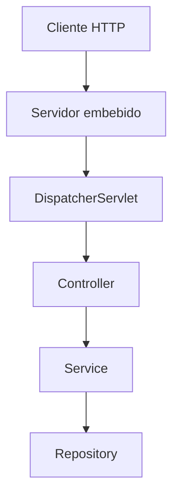

# LEIDO!!

# Unidad 5 — Spring y Spring Boot desde cero

## Antes de empezar

Este capítulo ya no es la primera explicación de Maven y de la estructura de un proyecto. Antes debes leer `00A-guia-previa-java-maven-y-proyectos.md`.

Continúa aquí cuando puedas explicar, al menos de manera sencilla, qué significa compilar, para qué sirve Maven, qué contiene `pom.xml` y por qué `target` es una salida generada. No necesitas dominar esos temas: este capítulo los repite dentro del contexto de Spring Boot.

Durante la lectura consulta únicamente `pom.xml`, `FintechLabInicioApplication.java`, `application.yml` y el árbol general de carpetas del laboratorio. Los controllers, services, repositories y entidades se explican después.

## La idea en una frase

Spring es un conjunto de herramientas que puede crear y conectar los objetos de una aplicación. Spring Boot usa esas herramientas y decisiones predeterminadas para entregar una aplicación ejecutable con mucha menos configuración manual.

No son sinónimos:

| Nombre           | Responsabilidad principal                                              | Ejemplo                                               |
| ---------------- | ---------------------------------------------------------------------- | ----------------------------------------------------- |
| Spring Framework | Contenedor, inyección, web, datos, transacciones y otras abstracciones | Crear un `CustomerService` y entregarle su repository |
| Spring MVC       | Parte web tradicional del ecosistema Spring                            | Asociar `GET /customers` a un método Java             |
| Spring Data JPA  | Integración de repositorios con JPA                                    | Generar la implementación de `JpaRepository`          |
| Spring Boot      | Arranque, autoconfiguración, starters, servidor embebido y operación   | Levantar la API con `main` y un `application.yml`     |

Spring Boot utiliza Spring; no lo reemplaza.

## El problema antes del framework

Imagina una API pequeña sin Spring. Tendrías que:

1. crear el servidor HTTP;
2. abrir un puerto y gestionar conexiones;
3. leer bytes y convertir JSON;
4. decidir qué método atiende cada ruta;
5. crear los servicios y repositorios en el orden correcto;
6. abrir y cerrar conexiones a la base;
7. traducir resultados a respuestas HTTP;
8. configurar logs, errores y apagado;
9. empaquetar todo para ejecutarlo.

Es posible hacerlo y resulta educativo una vez. El problema es repetir infraestructura en cada proyecto. Spring ofrece piezas reutilizables y un contenedor para coordinarlas. Spring Boot observa las dependencias y propiedades disponibles, aplica configuraciones razonables y permite concentrarte en el comportamiento de la aplicación.

El framework no decide el negocio por ti. No sabe si una cuenta puede quedar en negativo, si un correo debe ser único o si una transferencia duplicada debe rechazarse. Automatiza mecánica; tú conservas la responsabilidad sobre el contrato y las reglas.

## Tres niveles que no debes mezclar

Cuando algo “funciona por Spring”, separa estas preguntas:

1. **Java:** ¿qué clase, método u objeto existe?
2. **Spring:** ¿quién lo crea, registra o conecta?
3. **Spring Boot:** ¿qué configuración se activó automáticamente y por qué?

Ejemplo: `CustomerController` sigue siendo una clase Java. `@RestController` permite que Spring MVC la registre como componente web. El starter web hace que Spring Boot configure Spring MVC, Jackson y un servidor embebido porque esas bibliotecas están presentes.

Esta separación evita atribuir magia a una anotación aislada.

## El proyecto mínimo

Esta sección es tu segunda exposición a Maven y a la estructura del proyecto. La guía previa explicó cada pieza lentamente; ahora las conectaremos con Spring Boot.

Un proyecto Maven de Spring Boot suele tener esta forma:

```text
fintechlab-inicio/
├── pom.xml
├── mvnw
├── mvnw.cmd
└── src/
    ├── main/
    │   ├── java/
    │   │   └── dev/fintechlab/inicio/
    │   │       └── FintechLabInicioApplication.java
    │   └── resources/
    │       └── application.yml
    └── test/
        └── java/
```

### `pom.xml`

Maven lee este archivo para conocer identidad, versión de Java, dependencias, plugins y forma de construir el proyecto. No es código Spring. Es el descriptor del build.

El parent de Spring Boot aporta versiones compatibles y valores predeterminados:

```xml
<parent>
  <groupId>org.springframework.boot</groupId>
  <artifactId>spring-boot-starter-parent</artifactId>
  <version>3.5.15</version>
  <relativePath/>
</parent>
```

Un starter agrupa dependencias que suelen trabajar juntas:

```xml
<dependency>
  <groupId>org.springframework.boot</groupId>
  <artifactId>spring-boot-starter-web</artifactId>
</dependency>
```

`spring-boot-starter-web` no es “la web completa” dentro de un solo archivo. Declara un conjunto compatible que incluye Spring MVC, soporte JSON y el servidor web predeterminado. Maven resuelve dependencias transitivas y las coloca en el classpath.

### Maven Wrapper

`mvnw` y `mvnw.cmd` permiten usar la versión de Maven prevista por el proyecto:

```bash
./mvnw test
./mvnw spring-boot:run
./mvnw clean package
```

En Windows PowerShell se usa normalmente:

```powershell
.\mvnw.cmd test
```

`clean` elimina resultados anteriores, `test` compila y ejecuta pruebas, `package` produce el JAR y `spring-boot:run` inicia la aplicación desde Maven. El orden de comandos no es una liturgia: elige el más pequeño que compruebe tu hipótesis.

### `src/main` y `src/test`

- `src/main/java`: código de la aplicación.
- `src/main/resources`: configuración, migraciones y recursos.
- `src/test/java`: pruebas.
- `target`: salida generada; no la edites a mano ni la uses como fuente.

El package debe coincidir con la ubicación y seguir una jerarquía estable. La clase principal se coloca en un package raíz para que el escaneo encuentre los componentes debajo.

## La clase principal

```java
package dev.fintechlab.inicio;

import org.springframework.boot.SpringApplication;
import org.springframework.boot.autoconfigure.SpringBootApplication;

@SpringBootApplication
public class FintechLabInicioApplication {

    public static void main(String[] args) {
        SpringApplication.run(FintechLabInicioApplication.class, args);
    }
}
```

`main` sigue siendo el punto de entrada de Java. `SpringApplication.run` inicia el proceso de Spring y devuelve un contexto de aplicación. La anotación compuesta `@SpringBootApplication` reúne tres ideas:

- `@Configuration`: la clase puede declarar configuración y beans;
- `@EnableAutoConfiguration`: Spring Boot considera configuraciones automáticas según classpath, propiedades y beans existentes;
- `@ComponentScan`: Spring busca componentes desde el package de la clase hacia abajo.

La anotación no inicia nada por sí sola. Si nadie ejecuta `main`, la aplicación no arranca.

## Qué ocurre realmente al pulsar Run

Una secuencia simplificada es:

1. La JVM ejecuta `main`.
2. `SpringApplication` deduce el tipo de aplicación a partir del classpath.
3. Se prepara el `Environment`: propiedades, perfiles y argumentos.
4. Se crea el `ApplicationContext`, el contenedor de Spring.
5. Se registran configuraciones y componentes encontrados.
6. La autoconfiguración evalúa condiciones.
7. Se crean y conectan los beans no perezosos.
8. Si es una aplicación web, se inicia el servidor embebido.
9. Se publican eventos de arranque y la aplicación queda lista.

Si cualquier dependencia obligatoria no puede crearse, el contexto no termina de arrancar. Por eso un error de conexión o un bean ausente puede detener toda la aplicación antes de recibir la primera petición.

### El servidor embebido

En un proyecto moderno no necesitas instalar Tomcat por separado para empezar. El starter web incluye un servidor que se inicia dentro del mismo proceso Java. El JAR contiene la aplicación y las dependencias necesarias para ejecutarla:

```bash
./mvnw clean package
java -jar target/fintechlab-inicio-1.0.0-SNAPSHOT.jar
```

“Embebido” no significa de juguete. Significa que el ciclo de vida del servidor forma parte de la aplicación y del artefacto ejecutable.

## Autoconfiguración sin magia

La autoconfiguración usa condiciones. Una configuración puede activarse solo si:

- una clase está en el classpath;
- falta un bean que tú podrías proporcionar;
- existe una propiedad o tiene cierto valor;
- la aplicación es web;
- hay un recurso particular.

Ejemplo conceptual: si Spring MVC y un servidor están en el classpath, Boot configura la infraestructura web. Si declaras tu propio bean de cierto tipo, muchas autoconfiguraciones “retroceden” para respetar tu decisión.

Por tanto, “convención sobre configuración” no significa “configuración inexistente”. Significa que el sistema toma decisiones predecibles mientras no las reemplaces.

Cuando necesites investigar el arranque, puedes habilitar el reporte de condiciones:

```bash
./mvnw spring-boot:run -Dspring-boot.run.arguments=--debug
```

El reporte es extenso. Úsalo para responder una pregunta concreta: qué configuración coincidió, cuál no y qué condición decidió el resultado.

## Qué sucede al abrir el proyecto en el editor

Abrir una carpeta no debería iniciar la API por sí mismo. Sin embargo, el editor puede realizar tareas automáticas:

- detectar `pom.xml` e importar el proyecto Maven;
- descargar o indexar dependencias;
- compilar para mostrar errores;
- ejecutar procesadores del lenguaje;
- detectar una configuración de ejecución anterior;
- restaurar una terminal o proceso que ya estaba activo.

Estas tareas pueden usar CPU y red, pero no equivalen necesariamente a servir HTTP. Para saber si la aplicación está realmente ejecutándose, busca evidencias:

- una consola con `Started FintechLabInicioApplication`;
- un proceso Java activo iniciado por el editor;
- el puerto configurado escuchando;
- una respuesta válida del endpoint de salud.

Comprobación típica:

```bash
curl -i http://localhost:8080/actuator/health
```

Si devuelve conexión rechazada, la aplicación no está escuchando en ese puerto. Si devuelve HTTP, sí hay un servidor, aunque tal vez sea otro proceso. No pulses Run repetidamente: podrías iniciar una segunda instancia y obtener “port already in use”.

## Leer el banner y el log de arranque

El banner confirma que Spring Boot comenzó, pero no que terminó correctamente. Busca el último evento significativo:

```text
Tomcat started on port 8080 (http)
Started FintechLabInicioApplication in 2.841 seconds
```

Si aparece `APPLICATION FAILED TO START`, lee el bloque de análisis y después recorre las causas. El mensaje útil suele parecerse a:

```text
Caused by: java.net.ConnectException: Connection refused
```

No arregles todas las líneas rojas. Muchas son consecuencias en cascada de una sola causa.

## Cómo llega una petición al código

Una petición no invoca directamente tu método Java. El recorrido simplificado es:



El servidor acepta la conexión. Spring MVC recibe el mensaje y busca un handler cuyo método y ruta coincidan. Los convertidores transforman JSON en objetos. Después de ejecutar tu código, el valor de retorno se serializa a JSON y se escribe como respuesta.

Este capítulo solo presenta el recorrido. Los capítulos 03 y 04 explican responsabilidades, validación y persistencia.

## Primer endpoint consciente

```java
package dev.fintechlab.inicio;

import java.time.Instant;
import org.springframework.web.bind.annotation.GetMapping;
import org.springframework.web.bind.annotation.RequestMapping;
import org.springframework.web.bind.annotation.RestController;

@RestController
@RequestMapping("/api/learning")
class LearningController {

    @GetMapping("/status")
    StatusResponse status() {
        return new StatusResponse("UP", Instant.now());
    }
}

record StatusResponse(String status, Instant checkedAt) {}
```

Aquí ocurren varias cosas diferentes:

- `@RestController` registra la clase como componente web y serializa retornos al body.
- `@RequestMapping` fija un prefijo común.
- `@GetMapping` asocia el método HTTP GET y la ruta restante.
- el record es un objeto Java de salida;
- Jackson lo convierte a JSON;
- la hora cambia en cada llamada, así que una prueba debería controlar qué aspecto verifica.

No hay service porque el ejemplo no contiene un caso de uso real. Crear capas vacías por costumbre no mejora el diseño.

## Spring Initializr y el proyecto incluido

Spring Initializr es un generador de estructura. Elegir dependencias allí modifica principalmente el descriptor del build y algunos archivos iniciales. No crea el diseño de negocio.

Para esta unidad ya existe un proyecto de referencia en:

`05-spring-boot-basico/codigo/fintechlab-inicio`

Utilízalo para comparar, no como texto sagrado. Primero identifica:

1. el parent y los starters del POM;
2. la clase con `main`;
3. el package raíz;
4. los archivos de propiedades;
5. el recurso web y sus capas;
6. las pruebas.

## Dependencias: añadir menos es una habilidad

Cada dependencia añade código, superficie de actualización, posibles vulnerabilidades y comportamiento automático. Antes de agregar una, responde:

- ¿qué problema observable resuelve?
- ¿ya existe una capacidad equivalente?
- ¿es necesaria en compilación, ejecución o solo pruebas?
- ¿su versión la administra Spring Boot?
- ¿cómo comprobaré que funciona?

Los scopes de Maven expresan disponibilidad. `test` limita una dependencia a las pruebas. `runtime` indica que el código se necesita al ejecutar, pero no para compilar tu fuente contra su API. No copies versiones individuales cuando el parent o BOM ya las administra.

## Empaquetado y classpath

Al compilar, Maven transforma fuente en bytecode y reúne recursos. El classpath es el conjunto de clases y recursos visibles para la JVM. Muchas decisiones de Boot dependen de él: si una biblioteca no está, la autoconfiguración relacionada ni siquiera aplica.

Errores frecuentes:

- `ClassNotFoundException`: una clase requerida no está disponible al ejecutar;
- `NoClassDefFoundError`: existía al compilar o cargar, pero falta o falló al inicializar;
- `NoSuchMethodError`: dos versiones incompatibles de una biblioteca se mezclaron;
- “package does not exist”: falta una dependencia de compilación o el import es incorrecto.

No resuelvas esos errores agregando bibliotecas al azar. Revisa el árbol:

```bash
./mvnw dependency:tree
```

## El límite de Spring Boot

Spring Boot puede:

- crear infraestructura común;
- aplicar valores predeterminados;
- unir configuración y dependencias;
- iniciar y observar una aplicación;
- facilitar empaquetado y pruebas.

No puede:

- decidir tus invariantes de negocio;
- elegir automáticamente una arquitectura adecuada;
- impedir que expongas datos sensibles;
- convertir un CRUD en un sistema confiable;
- sustituir pruebas y razonamiento;
- garantizar compatibilidad si cambias versiones sin control.

Usar Spring Boot profesionalmente consiste en aprovechar su automatización y conservar visibilidad sobre sus condiciones y límites.

## Errores iniciales frecuentes

### Colocar la clase principal demasiado abajo

Si `FintechLabInicioApplication` está en `dev.fintechlab.inicio.app` y el controller está en `dev.fintechlab.inicio.customer`, el escaneo predeterminado no sube a paquetes hermanos. Sitúa la clase principal en el package raíz o configura el escaneo de forma consciente.

### Ejecutar una clase que no es la entrada

Un controller no tiene `main`. Ejecuta la clase principal o el goal de Spring Boot.

### Confundir compilación con ejecución

Que el editor no marque errores no significa que el servidor esté iniciado. Que el servidor inicie no significa que el endpoint o la base funcionen.

### Editar `target`

Los cambios se pierden en el siguiente build. Modifica `src`.

### Usar una versión de Java diferente

Comprueba tanto la terminal como el JDK del editor. Maven puede usar un JDK distinto del botón Run.

```bash
java -version
./mvnw -version
```

### Pulsar Run varias veces

La primera instancia conserva el puerto; la segunda falla. Detén el proceso anterior o cambia temporalmente `server.port`, sabiendo por qué.

## Práctica de recuperación

Sin mirar el capítulo, dibuja y explica:

1. qué lee Maven;
2. qué ejecuta la JVM;
3. qué crea Spring;
4. qué decide Spring Boot;
5. cuándo arranca el servidor;
6. cómo verificas que quedó listo.

Después compara tu dibujo con el recorrido de arranque. Corrige relaciones, no solo palabras.

## Resumen operativo

- Spring Boot no es un editor ni un servidor externo: es una forma de configurar y arrancar aplicaciones Spring.
- `main` inicia el proceso; `@SpringBootApplication` declara configuración, autoconfiguración y escaneo.
- Maven administra construcción y dependencias; el Wrapper conserva reproducibilidad.
- Los starters activan capacidades mediante un classpath coherente.
- Abrir el proyecto puede importar e indexar; solo ejecutar la aplicación levanta el servidor.
- Un arranque correcto termina con evidencia en logs y un endpoint accesible.
- La automatización se entiende observando sus entradas: dependencias, propiedades, beans y condiciones.

## Antes de continuar

Debes poder responder con tus palabras:

- ¿qué diferencia hay entre Spring y Spring Boot?
- ¿por qué un starter puede cambiar el arranque sin que hayas escrito código?
- ¿qué tres funciones compone `@SpringBootApplication`?
- ¿cómo distingues importar el proyecto de ejecutar el servidor?
- ¿por qué la clase principal suele estar en el package raíz?

Si las respuestas dependen de repetir frases, abre el proyecto de referencia y localiza una evidencia concreta para cada una. Después continúa con `02-ioc-di-beans-y-configuracion.md`.
