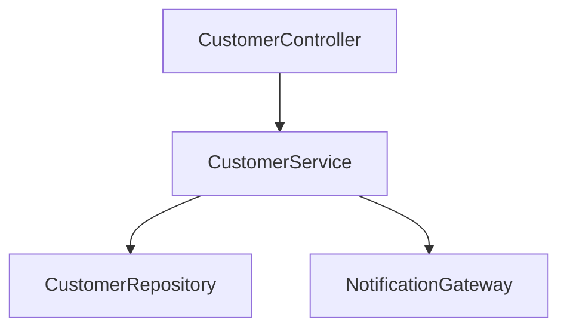

# Unidad 5 — IoC, inyección de dependencias, beans y configuración

## El problema: crear objetos no basta

En Java puedes construir una aplicación manualmente:

~~~java
CustomerRepository repository = new InMemoryCustomerRepository();
EmailGateway gateway = new ConsoleEmailGateway();
CustomerService service = new CustomerService(repository, gateway);
CustomerController controller = new CustomerController(service);
~~~

Este código es válido. También muestra un problema: algún lugar debe conocer todas las implementaciones, construirlas en orden, compartirlas cuando corresponde y cerrarlas cuando la aplicación termina. A medida que el grafo crece, esa composición manual se vuelve repetitiva.

Spring actúa como un ensamblador. Tú declaras qué objetos administra y qué necesita cada uno; el contenedor crea el grafo.

## Cuatro términos que debes separar

### Dependencia

Una clase A depende de B cuando necesita B para cumplir su responsabilidad.

~~~java
class CustomerService {
    private final CustomerRepository repository;

    CustomerService(CustomerRepository repository) {
        this.repository = repository;
    }
}
~~~

`CustomerRepository` es una dependencia de `CustomerService`. Esto es Java puro; todavía no hay Spring.

### Inyección de dependencias

La clase recibe la dependencia desde fuera en lugar de construirla internamente.

~~~java
// Evitar en un servicio:
private final CustomerRepository repository = new JpaCustomerRepository(...);
~~~

Recibir por constructor permite sustituir la implementación, comprobar requisitos al crear el objeto y probar el servicio sin levantar todo el framework.

### Inversión de control

IoC describe el cambio de quién dirige la creación y el ciclo de vida. En vez de que tu código principal construya cada objeto, el contenedor controla esa composición y llama a los puntos definidos por la aplicación.

La inyección es un mecanismo para aplicar IoC; no son exactamente la misma palabra.

### Bean

Un bean es un objeto administrado por el contenedor de Spring. Todo bean es un objeto Java; no todo objeto Java es un bean.

~~~java
CustomerService service = new CustomerService(repository); // objeto manual
~~~

Si tú lo creas con `new`, Spring normalmente no conoce ese objeto ni inyecta sus campos. Si el contenedor lo crea o registra, puede participar en inyección, proxies, transacciones y ciclo de vida.

## `ApplicationContext`: el contenedor

El contexto conserva definiciones de beans, crea instancias, resuelve dependencias, aplica postprocesadores y publica eventos. Puedes imaginar un grafo dirigido:

Spring debe encontrar exactamente un candidato adecuado para cada flecha obligatoria. Si encuentra cero, el arranque falla por dependencia ausente. Si encuentra varios sin criterio para elegir, falla por ambigüedad. Es mejor fallar al arrancar que descubrir una referencia nula en una petición real.

## Dos formas principales de declarar beans

### Escaneo de componentes

Anotas una clase y Spring la detecta dentro del área escaneada:

~~~java
@Service
class CustomerService {
    private final CustomerRepository repository;

    CustomerService(CustomerRepository repository) {
        this.repository = repository;
    }
}
~~~

Estereotipos frecuentes:

| Anotación | Significado humano | Comportamiento adicional relevante |
|---|---|---|
| `@Component` | Componente general | Lo registra como candidato |
| `@Service` | Servicio o caso de uso | Expresa intención; se registra como componente |
| `@Repository` | Adaptador de persistencia | Expresa intención y participa en traducción de excepciones de persistencia |
| `@Controller` | Componente MVC | Devuelve vistas salvo configuración adicional |
| `@RestController` | Controller HTTP con body | Combina controller y serialización de retorno |

`@Service` no vuelve correcto un método de negocio. Su mayor valor inmediato es comunicar el rol y permitir que Spring encuentre la clase.

### Configuración explícita

Para clases de bibliotecas o cuando quieres controlar la construcción:

~~~java
@Configuration
class ClockConfiguration {

    @Bean
    Clock applicationClock() {
        return Clock.systemUTC();
    }
}
~~~

Ahora `Clock` puede inyectarse:

~~~java
@Service
class CustomerService {
    private final Clock clock;

    CustomerService(Clock clock) {
        this.clock = clock;
    }
}
~~~

Usa escaneo para componentes propios con un rol claro y `@Bean` para construcción explícita, objetos externos o variantes que requieren configuración.

## Por qué se recomienda el constructor

Compara tres estilos.

### Inyección por campo

~~~java
@Autowired
private CustomerRepository repository;
~~~

Es breve, pero oculta que el objeto es inválido sin repository, dificulta construirlo en una prueba Java y obliga al framework o reflexión a completar el campo.

### Inyección por setter

~~~java
@Autowired
void setRepository(CustomerRepository repository) {
    this.repository = repository;
}
~~~

Puede ser útil para una dependencia realmente opcional o reconfigurable, pero permite crear un objeto incompleto.

### Inyección por constructor

~~~java
private final CustomerRepository repository;

CustomerService(CustomerRepository repository) {
    this.repository = repository;
}
~~~

Hace obligatoria la dependencia, permite `final`, facilita pruebas y muestra el diseño en la firma. Si hay un solo constructor, no necesitas `@Autowired`.

Un constructor con ocho dependencias no es un problema de Spring; suele ser una señal de que la clase concentra demasiadas responsabilidades.

## Interfaces, implementaciones y repositorios generados

La inyección no exige una interfaz para cada clase. Crea una interfaz cuando represente una frontera útil o existan implementaciones intercambiables.

~~~java
interface NotificationGateway {
    void customerCreated(String customerId);
}

@Component
class LogNotificationGateway implements NotificationGateway {
    // implementación
}
~~~

Spring puede inyectar `LogNotificationGateway` donde se pide `NotificationGateway` porque es asignable a ese tipo.

Con Spring Data, declaras una interfaz repository y el framework crea un proxy en ejecución:

~~~java
interface CustomerRepository extends JpaRepository<CustomerEntity, String> {
    boolean existsByEmailIgnoreCase(String email);
}
~~~

No falta un archivo `CustomerRepositoryImpl`. Spring Data interpreta la interfaz y registra una implementación proxy. Esto funciona porque el starter, JPA y el escaneo de repositorios están activos.

## Un bean no siempre es la clase visible

Spring puede envolver un objeto con un proxy para agregar comportamiento transversal, como transacciones o seguridad. El proxy recibe la llamada, abre una transacción, invoca el objeto real y confirma o revierte.

Consecuencia: llamar un método anotado desde otro método del mismo objeto puede evitar el proxy. Las unidades avanzadas profundizan ese límite. Por ahora conserva esta regla: las anotaciones como `@Transactional` no son instrucciones que Java ejecute directamente; requieren infraestructura de Spring alrededor del bean.

## Ambigüedad y selección

Si hay dos implementaciones:

~~~java
@Component
class EmailNotificationGateway implements NotificationGateway {}

@Component
class SmsNotificationGateway implements NotificationGateway {}
~~~

Spring no puede adivinar cuál inyectar. Soluciones conscientes:

- eliminar el candidato accidental;
- inyectar una colección si necesitas ambos;
- marcar uno `@Primary`;
- usar `@Qualifier` con un nombre estable;
- separar por perfiles si pertenecen a ambientes diferentes.

No uses `@Primary` para ocultar una ambigüedad que no comprendes.

~~~java
CustomerService(@Qualifier("emailNotificationGateway") NotificationGateway gateway) {
    this.gateway = gateway;
}
~~~

## Dependencias opcionales

Una dependencia que el caso de uso necesita no debería ser opcional. Para capacidades realmente opcionales existen `Optional<T>`, `ObjectProvider<T>` o condiciones de configuración, pero añaden ramas. Primero pregunta si el sistema puede cumplir su contrato sin esa capacidad.

## Ciclo de vida y alcance

El alcance predeterminado es singleton por contexto: Spring crea una instancia del bean y la comparte. No significa singleton global de la JVM ni garantiza seguridad entre hilos.

Una aplicación web atiende muchas peticiones concurrentes usando el mismo service. Por eso los beans singleton deberían evitar estado mutable específico de una petición:

~~~java
@Service
class UnsafeService {
    private String currentCustomerId; // se mezcla entre peticiones
}
~~~

Conserva estado de petición en variables locales o estructuras diseñadas para concurrencia. La base de datos, no un campo del service, es la fuente persistente.

Otros scopes, como request o session, existen, pero no son necesarios para el CRUD inicial. Elegirlos sin necesidad hace el ciclo de vida más difícil de razonar.

Para inicialización y cierre:

~~~java
@PostConstruct
void initialize() { }

@PreDestroy
void close() { }
~~~

No realices migraciones manuales ni operaciones remotas largas en `@PostConstruct`: pueden volver frágil el arranque. Usa mecanismos específicos y observables.

## Dependencias circulares

~~~text
CustomerService -> NotificationService -> CustomerService
~~~

El contenedor no puede construir de forma limpia un ciclo de constructores. Una dependencia circular suele indicar responsabilidades mezcladas, no una anotación faltante.

Posibles rediseños:

- extraer una tercera responsabilidad;
- invertir una dependencia mediante una interfaz de frontera;
- publicar un evento cuando la consistencia no necesita ser inmediata;
- mover la coordinación a un caso de uso superior.

Evita activar referencias circulares o usar inyección perezosa como arreglo automático. Primero rompe el ciclo conceptual.

## Configuración: código que cambia entre ambientes

La configuración representa valores que varían sin recompilar: puertos, URLs, tamaños de pool, flags y credenciales suministradas por el entorno.

`application.yml`:

~~~yaml
server:
  port: 8080

spring:
  application:
    name: fintechlab-inicio

learning:
  welcome-message: "Entorno local"
  maximum-page-size: 50
~~~

La misma estructura puede escribirse en `application.properties`:

~~~properties
server.port=8080
spring.application.name=fintechlab-inicio
~~~

Elige un formato y sé consistente. YAML es sensible a indentación; propiedades es plano y explícito.

## Leer una propiedad aislada

~~~java
@Component
class WelcomeMessage {
    private final String value;

    WelcomeMessage(@Value("${learning.welcome-message}") String value) {
        this.value = value;
    }
}
~~~

`@Value` es útil para un valor. Para un grupo, usa configuración tipada:

~~~java
@ConfigurationProperties(prefix = "learning")
public record LearningProperties(
        String welcomeMessage,
        int maximumPageSize) {
}
~~~

Registra el record con `@ConfigurationPropertiesScan` en la aplicación o `@EnableConfigurationProperties`. La configuración tipada agrupa intención, permite validación y evita cadenas repetidas.

## Fuentes y precedencia

Spring Boot combina varias fuentes: archivos, variables de entorno, propiedades del sistema y argumentos de línea. Una fuente de mayor precedencia puede reemplazar otra.

~~~bash
SERVER_PORT=9090 ./mvnw spring-boot:run
~~~

Comprender precedencia evita el misterio de “cambié el YAML y no pasó nada”. Busca una variable, un argumento o un perfil que esté sobrescribiendo el valor.

No necesitas memorizar toda la lista de precedencia. Sí debes saber inspeccionar qué fuentes entregas al proceso y registrar el perfil activo.

## Perfiles

Un perfil activa configuración o beans para un ambiente o propósito:

- `application.yml`: base común;
- `application-mysql.yml`: diferencias para MySQL;
- `application-test.yml`: configuración de pruebas cuando es necesaria.

Activación:

~~~bash
SPRING_PROFILES_ACTIVE=mysql ./mvnw spring-boot:run
~~~

O como argumento:

~~~bash
./mvnw spring-boot:run -Dspring-boot.run.profiles=mysql
~~~

Un perfil no es un mecanismo de seguridad. Si versionas una contraseña en `application-prod.yml`, sigue expuesta.

Puedes seleccionar beans:

~~~java
@Profile("local")
@Component
class ConsoleNotificationGateway implements NotificationGateway {}
~~~

Usa perfiles para diferencias de ambiente claras, no para crear docenas de aplicaciones invisibles dentro del mismo código.

## Variables de entorno y secretos

~~~yaml
spring:
  datasource:
    url: ${DB_URL}
    username: ${DB_USER}
    password: ${DB_PASSWORD}
~~~

`${DB_URL}` exige un valor. `${DB_PORT:3306}` define `3306` como predeterminado.

Reglas mínimas:

- nunca versionar credenciales reales;
- no escribir passwords, tokens o bodies sensibles en logs;
- usar valores ficticios solo para el entorno local claramente marcado;
- fallar de manera explícita si un secreto obligatorio falta;
- usar el gestor de secretos de la plataforma en producción.

`.env` puede facilitar desarrollo local, pero trátalo como secreto e inclúyelo en `.gitignore`. Proporciona un `.env.example` sin valores reales si el equipo lo necesita.

## Configuración frente a constantes de negocio

No todo valor debe ser configurable. El puerto cambia por ambiente; una regla fundamental como “un importe no puede ser negativo” pertenece al dominio y no debería alterarse accidentalmente con una variable.

Pregunta: ¿cambiar el valor requiere una decisión de negocio y pruebas, o solo adaptar el despliegue? La primera suele ser código o datos gobernados; la segunda suele ser configuración.

## Anotaciones: metadatos, no hechizos

Una anotación agrega metadatos. Alguna infraestructura debe leerlos. Para cada anotación, pregunta:

1. ¿quién la procesa?
2. ¿cuándo la procesa?
3. ¿qué objeto o proxy produce?
4. ¿qué ocurre si la clase no es bean?
5. ¿cómo puedo observar el resultado?

Ejemplo: `@Service` la detecta el escaneo, `@Transactional` la interpreta la infraestructura transaccional, `@Valid` activa validación en un límite compatible y `@Entity` la interpreta JPA. No todas pertenecen al mismo subsistema.

## Cómo inspeccionar el grafo sin depender de memoria

Señales útiles:

- el constructor enumera dependencias obligatorias;
- el log de arranque muestra fallos de resolución;
- el IDE puede navegar de interfaz a implementaciones;
- una prueba Java puede construir el service manualmente;
- Actuator puede exponer información controlada en entornos seguros.

No expongas el inventario completo de beans públicamente en producción. Las herramientas de diagnóstico también amplían superficie de información.

## Errores comunes y lectura precisa

### “No qualifying bean of type…”

Spring encontró cero candidatos. Revisa:

- ¿la clase está anotada o declarada con `@Bean`?
- ¿está debajo del package escaneado?
- ¿la dependencia requerida tiene el tipo correcto?
- ¿un perfil o condición la desactivó?
- ¿falta un starter que genere el bean?

### “expected single matching bean but found 2”

Hay varios candidatos. Decide cuál corresponde; no borres uno al azar.

### “requested bean is currently in creation”

Busca un ciclo de dependencias. Dibuja flechas desde los constructores.

### Propiedad no resuelta

Comprueba nombre exacto, perfil activo y fuente. Diferencia entre una variable ausente y una propiedad mal indentada.

### El bean existe pero la anotación no hace efecto

Verifica si el objeto lo creó Spring, si la llamada atraviesa el proxy y si está activa la infraestructura correspondiente.

## Ejemplo completo de composición

~~~java
public interface CustomerClock {
    Instant now();
}

@Configuration
class TimeConfiguration {
    @Bean
    CustomerClock customerClock(Clock clock) {
        return () -> Instant.now(clock);
    }

    @Bean
    Clock clock() {
        return Clock.systemUTC();
    }
}

@Service
class RegistrationService {
    private final CustomerRepository repository;
    private final CustomerClock clock;

    RegistrationService(CustomerRepository repository, CustomerClock clock) {
        this.repository = repository;
        this.clock = clock;
    }
}
~~~

El contexto crea `Clock`, lo entrega al método que crea `CustomerClock`, encuentra el repository generado y construye `RegistrationService`. La prueba unitaria puede omitir Spring y pasar una lambda de tiempo fijo.

## Reglas de diseño para esta unidad

1. Dependencias obligatorias por constructor.
2. Campos de beans singleton sin estado mutable de petición.
3. `@Bean` para construcción externa o explícita; estereotipos para roles propios.
4. Interfaces solo en fronteras útiles.
5. Secretos fuera del repositorio.
6. Perfiles pocos y con propósito documentado.
7. Un error de grafo se resuelve entendiendo el grafo.
8. Una anotación se justifica por el mecanismo que activa.

## Práctica de recuperación

Toma `CustomerService` del proyecto de referencia y realiza estas acciones sin modificarlo:

1. enumera sus dependencias obligatorias;
2. identifica quién crea cada una;
3. dibuja las flechas hasta el controller;
4. indica qué objeto podrías construir con `new` en una prueba;
5. predice el mensaje si eliminas temporalmente `@Service`;
6. comprueba la predicción y revierte el cambio.

No conserves el proyecto roto. El objetivo es relacionar una causa con una evidencia.

## Resumen

- IoC cambia quién controla composición y ciclo de vida.
- DI entrega dependencias desde fuera; el constructor hace explícito el contrato.
- Un bean es un objeto gestionado por Spring.
- El contexto resuelve un grafo y falla si falta o sobra un candidato sin decisión.
- El alcance singleton exige evitar estado mutable de cada petición.
- Las configuraciones automáticas y los proxies siguen reglas observables.
- Propiedades y perfiles adaptan ambientes; no deben contener secretos reales.
- Las anotaciones necesitan un procesador y un contexto: no actúan por sí mismas.

Continúa con `03-api-rest-controller-service-repository-crud.md`, donde el grafo se convierte en una API visible.
