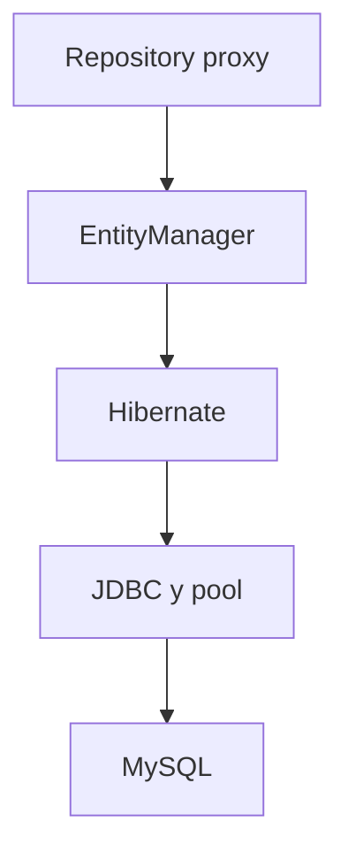

# Unidad 5 — JPA, MySQL, pruebas y diagnóstico

## De objetos a datos persistentes

Una variable desaparece cuando termina el proceso. Una base de datos conserva estado, permite consultarlo y coordina accesos concurrentes. JPA ayuda a mapear objetos Java a un modelo relacional, pero no elimina la necesidad de comprender tablas, restricciones y transacciones.

## Las piezas y sus límites

| Pieza | Qué es | Qué no es |
|---|---|---|
| MySQL | Motor relacional que guarda y consulta datos | Una biblioteca Java |
| JDBC | API Java para comunicarse con bases relacionales | Un ORM |
| DataSource | Fábrica/pool de conexiones | Una tabla |
| JPA | Especificación de persistencia y mapeo objeto-relacional | Una implementación concreta |
| Hibernate | Implementación de JPA usada habitualmente por Boot | La base de datos |
| Spring Data JPA | Abstracción de repositories sobre JPA | Sustituto de SQL y diseño de datos |
| Flyway | Herramienta de migraciones versionadas | Generador automático del modelo correcto |

Cuando dices “JPA guardó”, normalmente ocurrió una cadena: el repository delegó al `EntityManager`, Hibernate generó SQL, JDBC obtuvo una conexión y MySQL ejecutó la sentencia.

## Configuración mínima con H2

El proyecto de referencia arranca por defecto con H2 en memoria:

~~~yaml
spring:
  datasource:
    url: jdbc:h2:mem:fintechlab;MODE=MySQL;DB_CLOSE_DELAY=-1
    username: sa
    password: ""
  jpa:
    hibernate:
      ddl-auto: create-drop
  flyway:
    enabled: false
~~~

Ventajas para el primer día:

- no requiere iniciar otro proceso;
- permite ver el recorrido web–JPA rápidamente;
- cada ejecución comienza limpia;
- facilita una prueba de contexto pequeña.

Límites:

- no reproduce completamente tipos, SQL, locks, índices ni comportamiento de MySQL;
- los datos desaparecen al cerrar;
- el modo compatible no convierte H2 en MySQL;
- un test verde en H2 no demuestra que una migración funcione en MySQL.

H2 es una rueda de entrenamiento, no la evidencia final de compatibilidad.

## Configuración con MySQL

`application-mysql.yml`:

~~~yaml
spring:
  datasource:
    url: ${DB_URL:jdbc:mysql://localhost:3306/fintechlab_inicio}
    username: ${DB_USER:fintechlab}
    password: ${DB_PASSWORD:local_dev_only}
  jpa:
    hibernate:
      ddl-auto: validate
  flyway:
    enabled: true
~~~

La configuración de ejemplo usa valores locales ficticios compatibles con Compose. En un entorno compartido o real, suministra secretos fuera del repositorio.

Activación:

~~~bash
docker compose up -d mysql
SPRING_PROFILES_ACTIVE=mysql ./mvnw spring-boot:run
~~~

La aplicación y MySQL son procesos diferentes. “Connection refused” significa normalmente que no hay un servidor escuchando en host/puerto o que la red no llega; “access denied” indica que sí respondió, pero rechazó credenciales; “unknown database” indica que el servidor existe, pero falta el esquema solicitado.

## Anatomía de una entidad

~~~java
@Entity
@Table(
        name = "customers",
        uniqueConstraints = @UniqueConstraint(
                name = "uk_customers_email",
                columnNames = "email"))
class CustomerEntity {

    @Id
    @Column(length = 36, nullable = false, updatable = false)
    private String id;

    @Column(name = "full_name", length = 120, nullable = false)
    private String fullName;

    @Column(length = 180, nullable = false)
    private String email;

    protected CustomerEntity() {}
}
~~~

- `@Entity`: el tipo participa en JPA.
- `@Table`: nombre y restricciones de tabla.
- `@Id`: identidad persistente.
- `@Column`: detalles de mapeo y parte de las restricciones.
- constructor sin argumentos: JPA necesita materializar objetos; puede ser `protected`.

Las anotaciones no crean por sí mismas una tabla estable para producción. Hibernate puede generar DDL en aprendizaje, pero las migraciones versionadas son la fuente controlada del esquema.

## Identidad

Estrategias frecuentes:

- ID numérico generado por la base;
- UUID generado por la aplicación o base;
- clave natural estable, usada con cautela.

El proyecto inicial usa UUID convertido a texto para simplificar compatibilidad entre H2 y MySQL. Un sistema real puede almacenar UUID de forma binaria por espacio y rendimiento. Esa optimización requiere decisiones de esquema, conversión y operación; no es necesaria para aprender el flujo.

No permitas que el cliente elija IDs internos por defecto. El servidor crea identidad y devuelve la ubicación.

## Estado de una entidad

JPA distingue, de forma simplificada:

- **transient:** objeto nuevo que el contexto no administra;
- **managed:** objeto asociado al contexto de persistencia;
- **detached:** fue administrado, pero ya no lo está;
- **removed:** marcado para eliminación.

Dentro de una transacción, una entidad cargada es administrada. Si cambias sus campos mediante un método, Hibernate detecta diferencias y genera SQL al hacer flush. Este mecanismo se llama dirty checking.

~~~java
@Transactional
CustomerResponse update(String id, UpdateCustomerRequest request) {
    CustomerEntity entity = findEntity(id); // managed
    entity.update(request.fullName(), request.email());
    return CustomerResponse.from(entity);
}
~~~

No confundas “el método terminó” con “la base confirmó”. El commit ocurre al salir correctamente del límite transaccional, y el SQL puede enviarse antes durante un flush.

## Repository y consultas derivadas

~~~java
interface CustomerRepository extends JpaRepository<CustomerEntity, String> {
    boolean existsByEmailIgnoreCase(String email);
    boolean existsByEmailIgnoreCaseAndIdNot(String email, String id);
    List<CustomerEntity> findByFullNameContainingIgnoreCase(String text);
}
~~~

Spring Data analiza nombres según una gramática. Son convenientes para consultas cortas. Si el nombre se convierte en una frase ilegible, usa una consulta explícita o una especificación adecuada.

Métodos heredados importantes:

- `save`: persiste o fusiona según identidad/estado;
- `findById`: devuelve `Optional`;
- `findAll`: devuelve todos; peligroso sin límite en tablas grandes;
- `existsById`: comprueba existencia;
- `delete`: elimina la entidad;
- variantes paginadas mediante `Pageable`.

Un repository es una abstracción útil, no garantía de consulta eficiente. Observa SQL y planes cuando el volumen lo requiera.

## Restricciones en varias capas

Para `email` obligatorio y único:

1. el DTO rechaza vacío y formato incorrecto;
2. el service normaliza y detecta conflicto para responder bien;
3. la base impone `NOT NULL` y `UNIQUE` para proteger concurrencia e integridad;
4. las pruebas cubren cada frontera relevante.

Duplicar una regla entre entrada y base no siempre es redundancia accidental: cada frontera protege contra un modo de fallo diferente.

## Transacciones desde cero

Una transacción agrupa operaciones como una unidad. Para un caso de uso que modifica datos:

~~~java
@Transactional
public CustomerResponse create(...) { ... }
~~~

Para lectura:

~~~java
@Transactional(readOnly = true)
public CustomerResponse findById(...) { ... }
~~~

Modelo inicial:

1. un proxy intercepta la llamada pública al bean;
2. abre o participa en una transacción;
3. ejecuta el método;
4. si termina, intenta confirmar;
5. ante una excepción no comprobada, revierte por defecto;
6. libera recursos.

`@Transactional` no arregla reglas ni evita toda carrera. La unidad 13 estudia ACID, aislamiento, locking y propagación. Aquí aprende a colocar el límite en el service que representa el caso de uso, no en cada llamada individual al repository.

## Migraciones con Flyway

Una migración es un cambio versionado e inmutable del esquema:

`src/main/resources/db/migration/V1__create_customers.sql`

~~~sql
CREATE TABLE customers (
    id VARCHAR(36) NOT NULL,
    full_name VARCHAR(120) NOT NULL,
    email VARCHAR(180) NOT NULL,
    PRIMARY KEY (id),
    CONSTRAINT uk_customers_email UNIQUE (email)
);
~~~

Flyway registra qué migraciones aplicó y ejecuta las pendientes en orden. Reglas iniciales:

- no edites una migración ya aplicada en un ambiente compartido;
- crea una nueva versión para el siguiente cambio;
- revisa compatibilidad y rollback operativo;
- usa `ddl-auto: validate` para comprobar que entidad y esquema concuerdan;
- no combines `create` automático y migraciones como dos autoridades en producción.

En H2 de aprendizaje, el proyecto usa `create-drop`; en el perfil MySQL usa Flyway y `validate`. La diferencia es deliberada y está documentada.

## Conexiones y pool

Abrir una conexión física por cada consulta es costoso. Un pool mantiene un conjunto limitado. Spring Boot configura uno cuando corresponde.

Una conexión no es infinita. Una transacción larga retiene recursos y puede bloquear otras operaciones. No realices llamadas HTTP lentas dentro de una transacción de base salvo que hayas diseñado conscientemente sus consecuencias.

Señales de problemas:

- timeout esperando conexión;
- muchas transacciones largas;
- pool agotado;
- conexiones que no validan después de una caída;
- consultas sin índice que ocupan recursos demasiado tiempo.

No aumentes el pool como primer reflejo. Mide demanda, duración de consultas, límites de MySQL y número de instancias.

## Ver SQL para aprender, sin filtrar datos

En local puedes activar temporalmente:

~~~yaml
spring:
  jpa:
    show-sql: true
    properties:
      hibernate:
        format_sql: true
~~~

Esto ayuda a relacionar repository con SQL, pero no es una estrategia de observabilidad para producción. Los parámetros pueden contener datos sensibles y el volumen puede ser enorme. Desactívalo o configura logging seguro según el ambiente.

## Pruebas: tres alcances iniciales

### Prueba unitaria del service

No inicia Spring ni una base. Construye el objeto con un mock o fake:

~~~java
@ExtendWith(MockitoExtension.class)
class CustomerServiceTest {

    @Mock
    CustomerRepository repository;

    @InjectMocks
    CustomerService service;

    @Test
    void rejectsDuplicatedEmail() {
        CreateCustomerRequest request =
                new CreateCustomerRequest("Ana Demo", "ana@example.test");
        when(repository.existsByEmailIgnoreCase("ana@example.test"))
                .thenReturn(true);

        assertThatThrownBy(() -> service.create(request))
                .isInstanceOf(CustomerEmailAlreadyExistsException.class);

        verify(repository, never()).save(any());
    }
}
~~~

Comprueba regla y colaboración. No demuestra mappings JPA ni HTTP.

### Slice web

`@WebMvcTest(CustomerController.class)` carga la parte MVC necesaria. El service se sustituye por mock.

~~~java
@WebMvcTest(CustomerController.class)
class CustomerControllerTest {

    @Autowired MockMvc mvc;
    @MockBean CustomerService service;

    @Test
    void rejectsInvalidBody() throws Exception {
        mvc.perform(post("/api/customers")
                .contentType(MediaType.APPLICATION_JSON)
                .content("""
                        {"fullName":"", "email":"invalid"}
                        """))
                .andExpect(status().isBadRequest());
    }
}
~~~

Comprueba mapping, deserialización y validación. No demuestra una base real.

### Contexto completo básico

~~~java
@SpringBootTest
class FintechLabInicioApplicationTest {

    @Test
    void contextLoads() {}
}
~~~

Comprueba que el grafo arranca con la configuración de prueba. Un test vacío de contexto no demuestra casos de uso, pero detecta wiring roto.

`@DataJpaTest`, Testcontainers y estrategias completas aparecen en la unidad 8. No intentes sustituir todos los niveles con `@SpringBootTest`: será más lento y localizará peor los fallos.

## Arrange, Act, Assert

Una prueba legible separa:

- **Arrange:** datos y colaboradores;
- **Act:** una sola conducta principal;
- **Assert:** resultado observable y efectos relevantes.

Evita probar métodos privados o detalles de implementación. Si refactorizar sin cambiar comportamiento rompe todas las pruebas, están demasiado acopladas.

## Qué probar en el CRUD inicial

| Riesgo | Prueba apropiada inicial |
|---|---|
| email duplicado se guarda | unitaria del service + restricción de base |
| body inválido entra al caso de uso | slice web |
| ID ausente responde status incorrecto | slice web con service que lanza excepción |
| repository derivado tiene mapping incorrecto | slice JPA o integración posterior |
| el grafo no arranca | `@SpringBootTest` |
| migración falla en MySQL | integración con MySQL/Testcontainers posterior |

No busques un número de tests. Elige evidencia por riesgo.

## El algoritmo para diagnosticar un fallo de arranque

### 1. Clasifica la fase

- compilación;
- creación del contexto;
- inicio del servidor;
- conexión/migración de base;
- primera petición;
- prueba.

### 2. Conserva la primera ejecución útil

Copia comando, perfil, versiones y log desde el encabezado relevante. No reemplaces la evidencia ejecutando diez variantes.

### 3. Lee causas de abajo hacia arriba

Busca `Caused by`. La traza superior dice qué bean no pudo crearse; la causa profunda suele decir por qué.

### 4. Formula una hipótesis verificable

Ejemplo: “el perfil mysql está activo, pero el contenedor no escucha en 3306”. Comprobaciones: perfil en log, estado de Compose y puerto. Evita “Spring está mal”.

### 5. Cambia una variable

Inicia MySQL o corrige la URL, pero no cambies a la vez driver, contraseña, versión y entidad.

### 6. Añade una comprobación reproducible

Una vez corregido, agrega test, healthcheck, validación de configuración o documentación para reducir recurrencia.

## Fallos comunes

### Puerto ocupado

~~~text
Web server failed to start. Port 8080 was already in use.
~~~

Detén la instancia anterior o asigna otro puerto. No mates procesos sin identificar cuál ocupa el puerto.

### Driver ausente

La URL requiere MySQL pero falta `mysql-connector-j`. Revisa el POM y el perfil, no añadas drivers múltiples.

### Conexión rechazada

El host o puerto no escucha. Comprueba el contenedor y el mapeo de puertos.

### Acceso denegado

El servidor respondió pero credenciales/permisos no coinciden. Revisa variables y usuario dentro del motor.

### Validación de esquema

`ddl-auto: validate` detecta columna, tipo o tabla incoherente. Revisa la migración aplicada y la entidad; no cambies a `update` para ocultarlo.

### Tabla no encontrada

Flyway puede estar desactivado, mirar otro esquema o no encontrar la ruta de migraciones. Comprueba historial y datasource efectivo.

### Método derivado inválido

Spring Data no reconoce una propiedad del nombre del método. Compara exactamente con los campos Java, no con el nombre SQL.

### LazyInitializationException

Se intentó cargar una relación perezosa fuera del contexto. No actives eager globalmente como parche. Diseña la consulta y mapea dentro del caso de uso. La unidad 13 lo profundiza.

## Logging básico y seguro

~~~java
private static final Logger log = LoggerFactory.getLogger(CustomerService.class);

log.info("customer_created customerId={}", customerId);
~~~

Registra eventos y claves técnicas no sensibles. Evita:

- contraseñas o tokens;
- body completo;
- datos personales innecesarios;
- stack trace de un error esperado en nivel alto;
- mensajes sin contexto como `error aquí`.

El log ayuda a explicar lo ocurrido; no sustituye una respuesta de API ni una métrica.

## Actuator y salud

El starter Actuator ofrece endpoints operativos. Con exposición mínima:

~~~yaml
management:
  endpoints:
    web:
      exposure:
        include: health,info
~~~

`/actuator/health` permite comprobar que el proceso responde y puede incluir indicadores autorizados. No expongas todos los endpoints sin seguridad: algunos revelan configuración y estructura interna.

“UP” tampoco demuestra que todas las funciones de negocio operen. Define liveness y readiness según el entorno en unidades operativas posteriores.

## Leer el proyecto de referencia

En `codigo/fintechlab-inicio`:

1. arranca con H2 y consulta health;
2. crea un cliente ficticio;
3. observa el SQL en local si lo activas temporalmente;
4. ejecuta pruebas;
5. inicia MySQL con Compose;
6. activa el perfil `mysql`;
7. comprueba que Flyway creó la tabla;
8. reinicia y verifica persistencia;
9. apaga solo los recursos de este proyecto.

No uses datos reales. El email `.test` está reservado para ejemplos y evita enviar mensajes reales.

## Qué se profundiza después

- Unidad 6: HTTP, GET, DELETE, caché y contratos.
- Unidad 7: JUnit, Mockito, dobles, cobertura y diseño testeable.
- Unidad 8: slices, integración, Testcontainers y E2E.
- Unidad 9: POST, PUT, idempotencia y concurrencia.
- Unidad 10: excepciones y contrato de errores.
- Unidad 13: SQL, modelo relacional, JPA, transacciones e índices.

No necesitas dominar ahora esos detalles. Sí debes reconocer dónde aparece cada problema.

## Criterio de comprensión

Puedes explicar este recorrido sin usar “Spring lo hace” como respuesta final:

Para cada flecha, indica qué dato cruza, qué fallo puede aparecer y qué prueba lo observa.

## Resumen

- JPA mapea y administra entidades; Hibernate implementa; JDBC comunica; MySQL persiste.
- H2 reduce fricción inicial, pero no demuestra compatibilidad con MySQL.
- La base conserva restricciones incluso si la aplicación valida antes.
- `@Transactional` define un límite mediante un proxy y un contexto de persistencia.
- Flyway convierte el esquema en historial versionado; `validate` evita divergencia silenciosa.
- Una prueba unitaria, web y de contexto responden preguntas distintas.
- Diagnosticar consiste en clasificar fase, leer causa, formular hipótesis y cambiar una variable.
- Logs y Actuator aportan evidencia solo si se configuran con límites seguros.

El siguiente archivo, `80-laboratorio-fintechlab-inicial.md`, reúne todos los mecanismos en una secuencia ejecutable desde cero.
